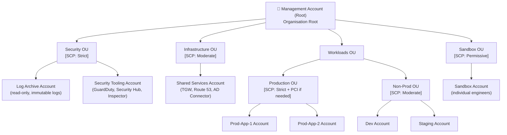

# Governance & Control Pillar

> **Why governance first?**
> Governance is the skeleton of your AWS environment. Without it, every account is an island: inconsistent security posture, untracked spend, no blast-radius containment, and no audit trail. Building governance last — or skipping it entirely — is how organisations end up with 200 accounts nobody fully understands and a $50k surprise on their AWS bill. Every module in this portfolio deploys *inside* the structure this pillar creates.

---

## Overview

This pillar covers the mechanisms that give an organisation *control* over its AWS footprint regardless of how large it grows:

| Component | What it governs |
|-----------|----------------|
| [Landing Zone](./landing-zone/) | OU structure, account vending, organisational baseline |
| [Control Tower](./control-tower/) | Automated guardrails, Account Factory, CfCT |
| [IAM](./iam/) | Identity federation, permission sets, cross-account access |
| [SCPs](./scps/) | Hard enforcement boundaries at the organisation layer |

---

## The AWS Multi-Account Strategy

### Why multiple accounts? Not just what — but *why*.

A single AWS account is convenient until something goes wrong, a team needs autonomy, or an auditor asks which resources belong to which system. The multi-account model solves five distinct problems:

#### 1. Blast Radius Containment
When a credential is compromised, a misconfiguration escapes, or a runaway process creates thousands of resources, the damage is **contained to a single account**. An attacker who pivots from a development workload cannot reach production data if production lives in a separate account with no trust relationship to dev.

> **Why?** AWS accounts are the strongest isolation boundary the platform provides. VPC security groups and IAM policies can be misconfigured. Account boundaries cannot be accidentally removed by an application team.

#### 2. Billing Isolation
Each account generates its own cost breakdown in AWS Cost Explorer and on the consolidated bill. Product teams, environments, and business units each have an undeniable view of what they are spending. Chargebacks become mechanical, not political.

> **Why?** Shared-account tagging strategies always drift. Teams forget tags. Tags get applied inconsistently. Account-level isolation makes cost attribution unambiguous.

#### 3. Security Boundary Enforcement
Service Control Policies (SCPs) apply at the account level within an Organisational Unit. Production accounts can be locked down in ways that would cripple a development account (e.g., requiring all S3 buckets to be private, denying instance types above a certain size). Dev accounts can permit looser access without weakening production posture.

#### 4. Separate Compliance Domains
PCI-DSS, HIPAA, SOC 2, and FedRAMP each define a *compliance scope*. Keeping PCI workloads in a dedicated account means your compliance audit scope is surgical — auditors review exactly the accounts that touch cardholder data, not your entire AWS estate.

#### 5. Team Autonomy
Application teams need the freedom to move quickly without requiring a central platform team to approve every resource. Separate accounts with appropriate SCPs give teams freedom *within guardrails* — they can do anything their account's SCP allows, and they cannot accidentally affect other teams' workloads.

---

## Landing Zone Architecture

The diagram below represents the recommended OU and account structure for an enterprise AWS environment. The hierarchy is deliberate — each OU receives a specific set of SCPs, and accounts inherit those SCPs from their parent OU.



### Why this specific structure?

| OU | Rationale |
|----|-----------|
| **Security OU** | Accounts here are owned by the security team, not application teams. No application workloads ever touch these accounts. Log Archive has a *deny delete logs* SCP to ensure audit trail immutability. |
| **Infrastructure OU** | Networking primitives (TGW, DNS) live here because they are shared services, not owned by any single app team. |
| **Workloads/Production OU** | Strictest SCPs. Only approved regions, no root actions, IMDSv2 required, no public S3. |
| **Workloads/Non-Prod OU** | Slightly relaxed — engineers can experiment — but still no public S3 and no region sprawl. |
| **Sandbox OU** | Maximum autonomy within cost guardrails. Engineers can explore new services. Resources are auto-tagged with expiry. |

---

## AWS Control Tower vs. DIY Landing Zone

Both approaches produce a multi-account AWS environment. The right choice depends on your organisation's velocity, existing footprint, and tolerance for managed services.

| Factor | AWS Control Tower | DIY (Terraform + Org APIs) | Recommendation |
|--------|-------------------|---------------------------|----------------|
| **Speed of initial setup** | Hours — wizard-driven | Days to weeks | Control Tower if starting fresh |
| **Customisation depth** | High via CfCT/AFT | Unlimited | DIY if you have non-standard requirements |
| **Cost** | No additional charge (underlying services billed normally) | Engineering time to build and maintain | Control Tower if team is small |
| **Auditability** | AWS-managed controls, some opacity | Full Terraform state, every change is PR-reviewed | DIY for strict compliance requirements |
| **Upgrade path** | AWS manages CT version upgrades | You own it | Control Tower if you want AWS to carry the operational burden |
| **Existing accounts** | Enrolment process required (has limitations) | Import into Terraform state | DIY if migrating a complex existing org |
| **SCP management** | Guardrails map to SCPs automatically | Full manual control | DIY for precise SCP authoring |

> **Decision:** This portfolio uses a Terraform DIY approach for full auditability and reproducibility in CI/CD. The [Control Tower module](./control-tower/) documents the equivalent managed-service approach and when to choose it.

---

## Service Control Policies (SCPs)

### How SCPs Work

SCPs define the **maximum permissions** available in an account. They do not grant permissions — they constrain them. Even if an IAM administrator in an account attaches `AdministratorAccess` to a role, that role cannot perform actions denied by the SCP on the account's OU.

```
Effective Permissions = SCP Allowances ∩ IAM Policy Allowances
```

This means:
- An action must be permitted by **both** the SCP *and* the IAM policy to succeed.
- An SCP deny overrides any IAM allow — including the AWS account root user (with limited exceptions).
- SCPs are inherited down the OU hierarchy. An SCP on the root applies to every account in the organisation.

### Deny-List vs. Allow-List

| Strategy | How it works | When to use |
|----------|-------------|-------------|
| **Deny-list** | Start with `"Effect": "Allow", "Action": "*"` and explicitly deny specific actions | Most enterprise environments — easier to manage, less risk of accidentally blocking needed services |
| **Allow-list** | Start with no implicit allow; explicitly permit only required actions | Highly regulated environments (PCI, government) where the set of permitted services is small and well-defined |

> **Why deny-list for most organisations?** AWS releases new services constantly. An allow-list requires updates every time your team wants to adopt a new service. A deny-list only requires updates when you want to *block* something new. The operational overhead is dramatically lower.

### Example SCPs

#### 1. Deny Actions Outside Allowed Regions

```json
{
  "Version": "2012-10-17",
  "Statement": [
    {
      "Sid": "DenyNonAllowedRegions",
      "Effect": "Deny",
      "NotAction": [
        "iam:*",
        "organizations:*",
        "route53:*",
        "budgets:*",
        "waf:*",
        "cloudfront:*",
        "globalaccelerator:*",
        "importexport:*",
        "support:*",
        "sts:*",
        "health:*"
      ],
      "Resource": "*",
      "Condition": {
        "StringNotEquals": {
          "aws:RequestedRegion": [
            "ca-central-1",
            "us-east-1"
          ]
        }
      }
    }
  ]
}
```

> **Why `NotAction` instead of `Action: "*"`?** Global services (IAM, Route 53, CloudFront) are not region-scoped. Denying them with a region condition breaks console login and billing. `NotAction` exempts these services from the region restriction.

#### 2. Deny Leaving the Organisation

```json
{
  "Version": "2012-10-17",
  "Statement": [
    {
      "Sid": "DenyLeaveOrganization",
      "Effect": "Deny",
      "Action": [
        "organizations:LeaveOrganization"
      ],
      "Resource": "*"
    }
  ]
}
```

> **Why?** Without this SCP, a compromised account root user could remove the account from the organisation, escaping all SCPs, guardrails, and centralised logging. This is a foundational control.

#### 3. Require IMDSv2 on All EC2 Instances

```json
{
  "Version": "2012-10-17",
  "Statement": [
    {
      "Sid": "RequireIMDSv2",
      "Effect": "Deny",
      "Action": "ec2:RunInstances",
      "Resource": "arn:aws:ec2:*:*:instance/*",
      "Condition": {
        "StringNotEquals": {
          "ec2:MetadataHttpTokens": "required"
        }
      }
    }
  ]
}
```

> **Why?** IMDSv1 is vulnerable to SSRF attacks that allow applications to steal EC2 instance credentials via the metadata endpoint. The 2019 Capital One breach exploited exactly this vector. IMDSv2 requires a PUT request to obtain a session token before metadata can be read, blocking SSRF-based credential theft.

---

## IAM Identity Center (SSO)

### Why Federated Access Beats Long-Lived Keys

Long-lived IAM access keys are one of the most common sources of AWS credential exposure. They appear in GitHub repositories, CI/CD logs, environment files, and developer machines. They do not expire unless explicitly rotated.

[AWS IAM Identity Center](https://docs.aws.amazon.com/singlesignon/latest/userguide/what-is.html) eliminates long-lived keys for human access by providing:
- **Short-lived credentials** (default 1–8 hours) per session
- **Centralised identity source** (AWS SSO store, Active Directory, or external IdP via SAML/OIDC)
- **Permission Sets** that are assigned to users/groups per account — not per IAM role scattered across accounts
- **Full audit trail** in CloudTrail showing which human assumed which permission set in which account

### Permission Sets vs. IAM Roles

| Concept | Permission Sets | IAM Roles |
|---------|----------------|-----------|
| **Scope** | Defined centrally in Identity Center, deployed to target accounts | Defined and stored in each account |
| **Assignment** | Assigned to users/groups per account | Assumed by anyone with `sts:AssumeRole` permission |
| **Credential lifetime** | Configurable per permission set (1–12 hours) | Configurable per role (15 minutes–12 hours) |
| **Audit** | CloudTrail shows user + permission set + account | CloudTrail shows principal ARN |
| **Management overhead** | Single pane of glass in Identity Center console | N accounts × M roles to maintain |

### Recommended Permission Set Structure

```
AdministratorAccess          → Platform/security team only, with MFA condition
PowerUserAccess              → Application team leads
ReadOnlyAccess               → All developers (default)
BillingAccess                → Finance team
NetworkAdministratorAccess   → Networking team
SecurityAuditAccess          → Security/compliance team
DatabaseAdministratorAccess  → DBA team
```

---

## Guardrails

AWS Control Tower guardrails (implemented as SCPs or AWS Config rules) fall into three categories: **Mandatory** (always enabled), **Strongly Recommended**, and **Elective**.

| # | Guardrail | Category | Severity |
|---|-----------|----------|----------|
| 1 | Disallow changes to AWS CloudTrail set up by Control Tower | Preventive | Critical |
| 2 | Disallow deletion of log archive | Preventive | Critical |
| 3 | Disallow changes to Amazon CloudWatch set up by Control Tower | Preventive | Critical |
| 4 | Disallow changes to AWS Config rules set up by Control Tower | Preventive | High |
| 5 | Detect whether MFA for the root user is enabled | Detective | Critical |
| 6 | Detect whether public read access to Amazon S3 buckets is allowed | Detective | High |
| 7 | Detect whether public write access to Amazon S3 buckets is allowed | Detective | High |
| 8 | Detect whether Amazon EBS volumes are encrypted | Detective | Medium |
| 9 | Detect whether unrestricted internet access is allowed through SSH | Detective | High |
| 10 | Detect whether Amazon S3 server access logging is enabled | Detective | Medium |

---

## ❓ FAQ

### Q: Can I use Control Tower if I already have existing accounts?

**A:** Yes, but with caveats. AWS Control Tower supports [enrolling existing accounts](https://docs.aws.amazon.com/controltower/latest/userguide/enroll-account.html) via Account Factory. However, if those accounts have resources that conflict with Control Tower's baseline (e.g., custom CloudTrail configurations, existing Config recorders), you will need to remediate those conflicts first. For organisations with many heavily-customised accounts, a DIY Terraform approach often causes less disruption.

### Q: Do SCPs override admin IAM policies?

**A:** Yes. An SCP `Deny` overrides *any* IAM `Allow`, including `AdministratorAccess`. The only exception is the management account — SCPs do not apply to the management account itself (which is why workloads must never run in the management account). The AWS root user in a member account is also constrained by SCPs.

### Q: What's the difference between an SCP and a Permission Boundary?

**A:** They operate at different layers. An SCP is applied to an AWS *account* or *OU* by the organisation's management account — it cannot be modified by anyone in the member account. A Permission Boundary is an IAM policy attached to a *role or user* within an account that caps its maximum permissions — it can be set by any IAM administrator in that account. SCPs are organisational enforcement; Permission Boundaries are account-level delegation constraints.

### Q: How many OUs should I have?

**A:** As few as needed to express distinct security and policy boundaries. AWS recommends starting with the five-OU structure shown above (Security, Infrastructure, Workloads/Prod, Workloads/Non-Prod, Sandbox) and adding OUs only when you need a genuinely different SCP policy. Creating an OU per application team is a common mistake — use account separation for team isolation, not OU separation.

### Q: How do I enroll existing accounts into Control Tower?

**A:** Use Account Factory in the Control Tower console and select "Enroll account". The account must already be in your AWS Organisation. Control Tower will apply its baseline CloudFormation StackSets to the account. See the [official enrollment guide](https://docs.aws.amazon.com/controltower/latest/userguide/enroll-account.html) for prerequisites and conflict resolution steps.

### Q: What happens if I delete the management account?

**A:** You cannot delete the management account while it has member accounts. You must first move all accounts out of the organisation (or close them), then you can close the management account through AWS Billing. Deleting the management account would orphan all SCPs, terminate consolidated billing, and remove all organisational audit trails — there is no recovery path.

### Q: Should I use AWS Organizations or Control Tower?

**A:** AWS Control Tower *is built on top of* AWS Organizations. Control Tower adds a UI, guardrails, Account Factory, and managed StackSets on top of the raw Organizations APIs. If you want full control via Terraform and are willing to manage the complexity yourself, use Organizations directly (as this portfolio's landing zone module does). If you want AWS to handle baseline enforcement and you are starting fresh, use Control Tower.

### Q: What is account vending and how does it work?

**A:** Account vending is the process of creating new AWS accounts on-demand with a pre-baked baseline configuration (tags, IAM roles, Config, CloudTrail, VPC). In Control Tower, this is Account Factory — a Service Catalog product that provisions accounts through a form. At scale, teams use [Account Factory for Terraform (AFT)](https://docs.aws.amazon.com/controltower/latest/userguide/aft-overview.html) to version-control account requests as Terraform, or the [Landing Zone Accelerator (LZA)](https://aws.amazon.com/solutions/implementations/landing-zone-accelerator-on-aws/) for a fully-automated pipeline.

---

## AWS Documentation Links

- [AWS Control Tower Documentation](https://docs.aws.amazon.com/controltower/latest/userguide/what-is-control-tower.html)
- [AWS Organizations Documentation](https://docs.aws.amazon.com/organizations/latest/userguide/orgs_introduction.html)
- [IAM Identity Center (SSO) Documentation](https://docs.aws.amazon.com/singlesignon/latest/userguide/what-is.html)
- [Service Control Policies Reference](https://docs.aws.amazon.com/organizations/latest/userguide/orgs_manage_policies_scps.html)
- [Landing Zone Accelerator on AWS](https://aws.amazon.com/solutions/implementations/landing-zone-accelerator-on-aws/)
- [Account Factory for Terraform (AFT)](https://docs.aws.amazon.com/controltower/latest/userguide/aft-overview.html)
- [AWS Security Reference Architecture](https://docs.aws.amazon.com/prescriptive-guidance/latest/security-reference-architecture/welcome.html)
