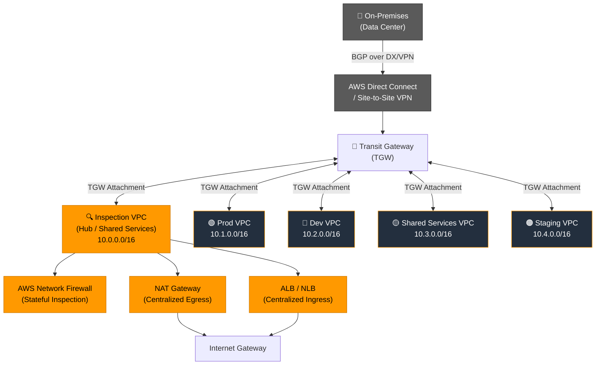
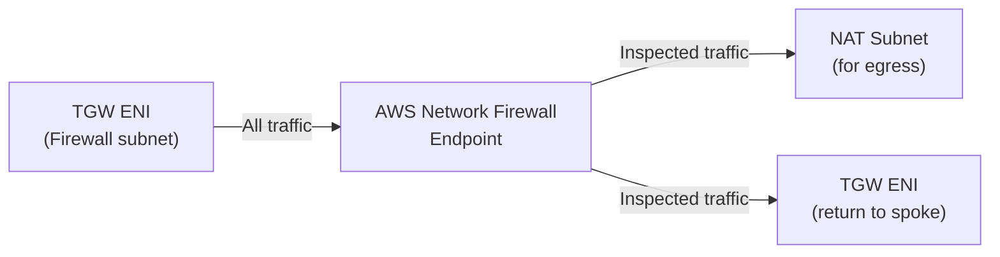
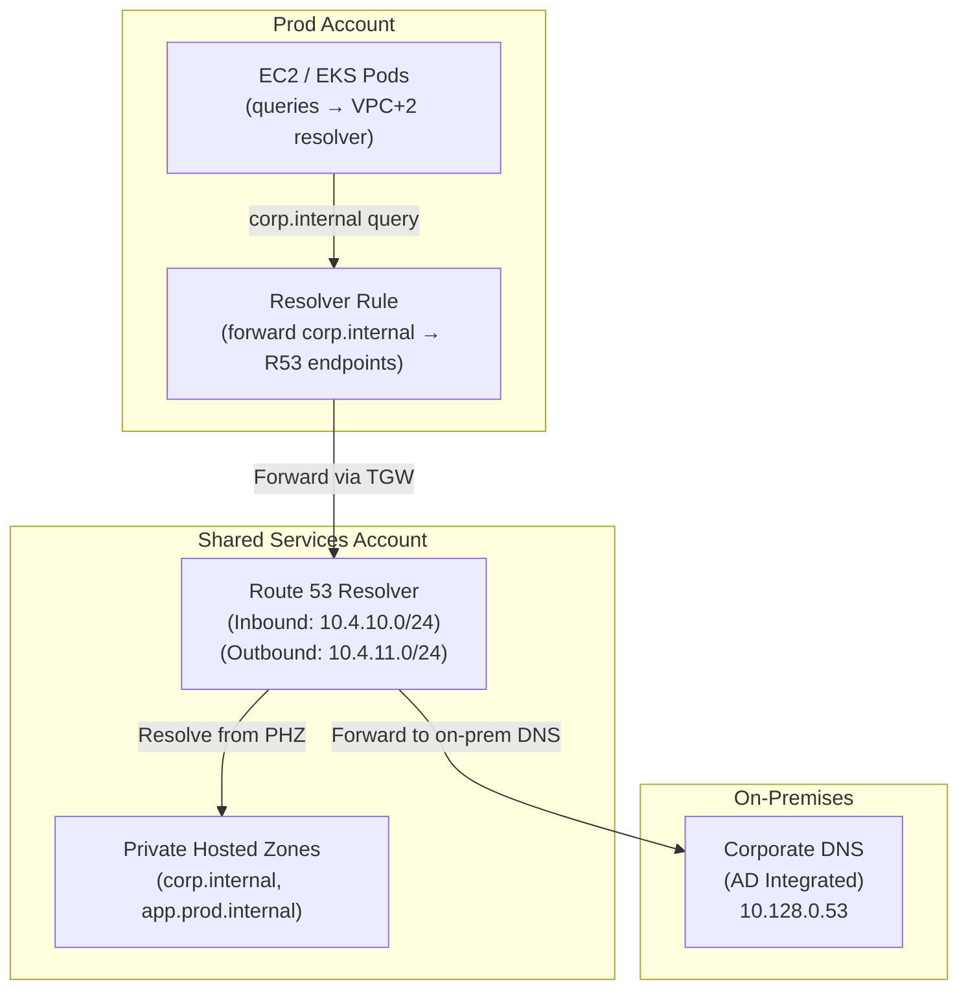

# 02 — Networking Pillar

**Author:** Moussa El Najmi, Senior AWS Solutions Architect  
**Last updated:** 2025  
**Status:** Production-ready reference architecture

---

## Table of Contents

1. [Overview](#overview)
2. [Hub-and-Spoke Topology](#hub-and-spoke-topology)
3. [VPC Design Principles](#vpc-design-principles)
4. [CIDR Allocation Table](#cidr-allocation-table)
5. [Transit Gateway (TGW)](#transit-gateway-tgw)
6. [AWS Network Firewall](#aws-network-firewall)
7. [Routing Tables Deep Dive](#routing-tables-deep-dive)
8. [Cross-Cloud Connectivity](#cross-cloud-connectivity)
9. [DNS Architecture](#dns-architecture)
10. [Monitoring](#monitoring)
11. [FAQ](#faq)
12. [AWS Documentation Links](#aws-documentation-links)

---

## Overview

Networking is not merely infrastructure plumbing — it is the **security boundary, performance envelope, and operational control plane** for everything running in your cloud. Get it wrong and you spend years refactoring CIDR ranges, patching blast radii, and explaining outages caused by an asymmetric routing bug at 2 AM.

> **Why does networking matter more than any other pillar?**
> Every other architectural decision — compute, storage, databases, security — sits on top of the network. A poorly designed VPC cannot be fixed without downtime. A CIDR block collision with on-premises cannot be resolved without re-addressing. Networking decisions have the longest blast radius and the highest migration cost of any cloud infrastructure choice.

Enterprise cloud networking must satisfy four simultaneous requirements:

| Requirement | What it means operationally |
|---|---|
| **Segmentation** | Prod workloads cannot reach dev; internet cannot reach databases |
| **Inspection** | All north-south and east-west traffic passes through a choke point |
| **Reachability** | Legitimate traffic reaches its destination with sub-millisecond latency overhead |
| **Observability** | Every packet path is logged, queryable, and alertable |

This pillar documents the patterns, Terraform modules, and trade-off decisions that deliver all four.

---

## Hub-and-Spoke Topology

### What it is

The hub-and-spoke model is the de-facto enterprise AWS network topology. A single **hub VPC** (also called the Shared Services or Inspection VPC) acts as the central nervous system. All other VPCs — production, non-production, staging, shared tools — are **spokes** that connect to the hub via Transit Gateway (TGW).

> **Why hub-and-spoke instead of full-mesh VPC peering?**
> VPC peering is non-transitive and doesn't scale. With _n_ VPCs, full-mesh peering requires _n(n-1)/2_ peering connections. At 20 VPCs that's 190 peering connections to manage. Transit Gateway reduces that to _n_ attachments with a single routing plane. More importantly, hub-and-spoke enables centralized traffic inspection — you cannot inspect east-west traffic with VPC peering because there is no choke point.

### Architecture Diagram



### Traffic Flow: Spoke → Internet (Egress)

```
Prod VPC EC2 instance
  → Prod VPC private subnet route table (0.0.0.0/0 → TGW)
  → TGW Prod route table (0.0.0.0/0 → Inspection domain)
  → TGW Inspection route table (routes to Inspection VPC)
  → Inspection VPC firewall subnet route table (0.0.0.0/0 → Network Firewall endpoint)
  → AWS Network Firewall (stateful inspection, policy enforcement)
  → Inspection VPC NAT subnet route table (0.0.0.0/0 → NAT Gateway)
  → NAT Gateway → Internet Gateway → Internet
```

### Traffic Flow: Internet → Spoke (Ingress)

```
Internet
  → Internet Gateway → ALB (in Inspection VPC public subnet)
  → ALB target group → PrivateLink / TGW to Prod VPC
  → Prod VPC application tier
```

### Traffic Flow: Spoke → Spoke (East-West)

```
Dev VPC EC2
  → Dev VPC route table (10.0.0.0/8 → TGW)
  → TGW NonProd route table (Blackhole for 10.1.0.0/16 — blocks Prod)
  → TGW routes Dev traffic to Inspection VPC for same-domain communication
  → Network Firewall enforces east-west policy
  → Destination Spoke VPC
```

> **Why route east-west through the firewall?**
> Without centralized east-west inspection, a compromised workload in any spoke VPC can reach every other spoke VPC over private RFC 1918 addresses — bypassing all perimeter controls. The hub-and-spoke topology with firewall in the inspection path eliminates this lateral movement vector entirely.

### Key Components

| Component | Role | AWS Service |
|---|---|---|
| Transit Gateway | Central router connecting all VPCs and on-premises | [AWS TGW](https://docs.aws.amazon.com/vpc/latest/tgw/what-is-transit-gateway.html) |
| Inspection VPC | Hosts firewall, NAT GW, centralized ingress | Custom VPC |
| Network Firewall | Stateful L3-L7 inspection | [AWS Network Firewall](https://docs.aws.amazon.com/network-firewall/latest/developerguide/what-is-aws-network-firewall.html) |
| NAT Gateway | Centralized outbound internet (single egress point) | [NAT Gateway](https://docs.aws.amazon.com/vpc/latest/userguide/vpc-nat-gateway.html) |
| TGW Route Tables | Traffic segmentation between domains | Part of TGW |

---

## VPC Design Principles

### CIDR Planning Strategy

> **Why is CIDR planning irreversible?**
> You cannot re-CIDR a VPC without destroying and recreating it. CIDR ranges that overlap with on-premises or other VPCs cause routing blackholes that are impossible to resolve without service disruption. Plan your entire address space before provisioning the first subnet.

**RFC 1918 Private Address Space:**
- `10.0.0.0/8` — 16,777,216 addresses (recommended for large enterprises)
- `172.16.0.0/12` — 1,048,576 addresses
- `192.168.0.0/16` — 65,536 addresses (avoid — conflicts with home networks and VPN clients)

**Recommended allocation strategy:**

```
10.0.0.0/8          ← Total enterprise pool
  ├─ 10.0.0.0/14    ← AWS Region 1 (us-east-1) — 262,144 addresses
  │    ├─ 10.0.0.0/16   ← Inspection/Hub VPC
  │    ├─ 10.1.0.0/16   ← Prod VPC
  │    ├─ 10.2.0.0/16   ← Dev VPC
  │    ├─ 10.3.0.0/16   ← Shared Services VPC
  │    └─ 10.4.0.0/16   ← Staging VPC
  ├─ 10.4.0.0/14    ← AWS Region 2 (eu-west-1) — 262,144 addresses
  ├─ 10.8.0.0/14    ← AWS Region 3 (ap-southeast-1) — future
  └─ 10.128.0.0/9   ← On-premises reserved (never use in AWS)
```

**Always reserve** a /16 block per VPC — even if you only initially subnet it to /24s. This guarantees room for EKS pod CIDRs, future AZ expansion, and new subnet tiers without VPC recreation.

### Subnet Tiers

Every production VPC uses three subnet tiers per Availability Zone:

| Tier | Purpose | Internet-facing? | Examples |
|---|---|---|---|
| **Public** | Resources that need direct internet access | Yes (IGW route) | ALB, NAT Gateway, Bastion (if needed) |
| **Private** | Application workloads | No (NAT via TGW or local NAT GW) | EC2, EKS nodes, Lambda, ECS |
| **Data (Isolated)** | Databases, caches, message queues | No (no outbound route) | RDS, ElastiCache, OpenSearch, MSK |

> **Why three tiers instead of two?**
> The data tier has no internet route by design — not even outbound via NAT. This means a compromised application server cannot exfiltrate data to the internet directly; it must go through a choke point. The tier boundary enforces data residency at the network layer, not just the application layer.

### Why 3 AZs in Production

AWS regions have a minimum of 3 Availability Zones. Running fewer in production means:
- An AZ failure reduces capacity by 50% instead of 33%
- Auto Scaling Groups cannot rebalance across enough domains
- RDS Multi-AZ failover leaves you with only one remaining AZ

**Minimum production footprint per VPC:**
- 3 × Public /24 subnets
- 3 × Private /24 subnets  
- 3 × Data /24 subnets
- 1 × TGW attachment subnet /28 (one per AZ, but /28 is sufficient — TGW only needs 1 IP per AZ)

### Subnet Sizing for EKS

EKS on VPC CNI assigns one VPC IP per pod. A `m5.4xlarge` node can run up to 234 pods. With 10 nodes in a node group:

```
10 nodes × 234 pods = 2,340 pod IPs required per node group
A /24 subnet provides only 251 usable IPs — insufficient for one node group alone
```

**Solutions:**
1. Use **VPC CNI prefix delegation** — each ENI gets a /28 prefix (16 IPs), multiplying pod density without consuming subnet IPs 1:1
2. Use **separate pod CIDR** with VPC CNI `ENABLE_PREFIX_DELEGATION=true`  
3. For very large clusters, allocate /22 or /21 private subnets (1,022 or 2,046 IPs each)

> **Why does EKS CIDR planning differ from standard VPC design?**
> Standard workloads (EC2, RDS) consume 1-2 IPs per resource. EKS with VPC CNI can consume hundreds of IPs per node due to pod-level IP assignment. Undersized subnets cause pod scheduling failures — the node gets stuck in `NodeNotReady` because it cannot obtain IPs. This is one of the most common EKS production incidents.

### Reserved CIDR Space

Always reserve at minimum:
- **25% of each VPC CIDR** for future subnets/tiers
- **One full /16 per future AWS region** in your enterprise plan
- A `/28` per AZ for TGW attachments (cannot overlap with other subnets)

---

## CIDR Allocation Table

Enterprise example with a `10.0.0.0/8` parent block across accounts:

| Account | Purpose | VPC CIDR | Public-A /24 | Public-B /24 | Public-C /24 | Private-A /24 | Private-B /24 | Private-C /24 | Data-A /24 | Data-B /24 | Data-C /24 | TGW /28 |
|---|---|---|---|---|---|---|---|---|---|---|---|---|
| **Network** | Hub / Inspection | `10.0.0.0/16` | `10.0.0.0/24` | `10.0.1.0/24` | `10.0.2.0/24` | `10.0.10.0/24` | `10.0.11.0/24` | `10.0.12.0/24` | `10.0.20.0/24` | `10.0.21.0/24` | `10.0.22.0/24` | `10.0.255.0/28` |
| **Production** | Prod workloads | `10.1.0.0/16` | `10.1.0.0/24` | `10.1.1.0/24` | `10.1.2.0/24` | `10.1.10.0/24` | `10.1.11.0/24` | `10.1.12.0/24` | `10.1.20.0/24` | `10.1.21.0/24` | `10.1.22.0/24` | `10.1.255.0/28` |
| **Dev** | Development | `10.2.0.0/16` | `10.2.0.0/24` | `10.2.1.0/24` | `10.2.2.0/24` | `10.2.10.0/24` | `10.2.11.0/24` | `10.2.12.0/24` | `10.2.20.0/24` | `10.2.21.0/24` | `10.2.22.0/24` | `10.2.255.0/28` |
| **Staging** | Pre-prod | `10.3.0.0/16` | `10.3.0.0/24` | `10.3.1.0/24` | `10.3.2.0/24` | `10.3.10.0/24` | `10.3.11.0/24` | `10.3.12.0/24` | `10.3.20.0/24` | `10.3.21.0/24` | `10.3.22.0/24` | `10.3.255.0/28` |
| **Shared Svcs** | Shared tools (AD, monitoring) | `10.4.0.0/16` | `10.4.0.0/24` | `10.4.1.0/24` | `10.4.2.0/24` | `10.4.10.0/24` | `10.4.11.0/24` | `10.4.12.0/24` | `10.4.20.0/24` | `10.4.21.0/24` | `10.4.22.0/24` | `10.4.255.0/28` |
| **Security** | GuardDuty, SIEM | `10.5.0.0/16` | — | — | — | `10.5.10.0/24` | `10.5.11.0/24` | `10.5.12.0/24` | — | — | — | `10.5.255.0/28` |
| **Log Archive** | Centralized logs | `10.6.0.0/16` | — | — | — | `10.6.10.0/24` | `10.6.11.0/24` | `10.6.12.0/24` | — | — | — | `10.6.255.0/28` |
| **Reserved (R2)** | Future region 2 | `10.16.0.0/12` | — | — | — | — | — | — | — | — | — | — |
| **On-Prem** | Reserved, never use in AWS | `10.128.0.0/9` | — | — | — | — | — | — | — | — | — | — |

> **Why use a consistent /24 scheme even when you don't need all IPs?**
> Consistency eliminates cognitive overhead. When every subnet is a /24, ops engineers always know that the second octet is the VPC, the third octet is the tier+AZ, and they can read any route table at a glance. Inconsistent sizing leads to routing table maintenance errors.

---

## Transit Gateway (TGW)

### What TGW Is

[AWS Transit Gateway](https://docs.aws.amazon.com/vpc/latest/tgw/what-is-transit-gateway.html) is a regional network transit hub. It acts as a cloud router that connects VPCs, VPNs, and Direct Connect gateways through a single managed hub, replacing the need for complex VPC peering meshes.

> **Why TGW instead of VPC Peering?**
> VPC peering is non-transitive: VPC A peers with VPC B, VPC B peers with VPC C — but VPC A **cannot** reach VPC C through B. Every pair that needs to communicate needs its own peering connection, creating O(n²) complexity. TGW is a fully transitive router — attach any VPC and it can reach any other attached VPC (subject to route table policy). At 10+ VPCs, TGW is not optional.

### TGW Route Table Design

TGW uses **route table domains** to enforce segmentation. Each domain has its own route table, and attachments are associated to exactly one table but can propagate to multiple tables.

```
TGW Route Tables:
├── shared-rt        ← Hub/Inspection VPC attachment associated here
│                      All other domains propagate into shared-rt (full visibility)
├── prod-rt          ← Prod VPC attachment associated here
│                      Propagates: shared-rt, on-prem-rt
│                      Blackhole: 10.2.0.0/16 (dev), 10.3.0.0/16 (staging)
│                      Default: 0.0.0.0/0 → Inspection VPC (for internet egress)
├── nonprod-rt       ← Dev + Staging VPC attachments associated here
│                      Propagates: shared-rt
│                      Blackhole: 10.1.0.0/16 (prod) ← critical isolation
│                      Default: 0.0.0.0/0 → Inspection VPC (for internet egress)
└── inspection-rt    ← Used by Inspection VPC to return-route to spokes
                       Propagates from all spoke VPCs
                       No blackholes — full visibility needed for routing return traffic
```

> **Why blackhole routes instead of just not propagating?**
> If a route is simply absent from the TGW route table, TGW drops the packet silently. A blackhole route explicitly drops traffic AND is visible in the route table — making the intent clear to operators and surfacing in Network Manager topology views. Explicit blackholes document security intent.

### TGW Sharing via RAM

Transit Gateway is a **per-region, per-account** resource. To share one TGW across multiple AWS accounts in an Organization:

1. Create the TGW in the **Network account** (owner)
2. Use [AWS Resource Access Manager (RAM)](https://docs.aws.amazon.com/ram/latest/userguide/what-is.html) to share the TGW with the Organization or specific OUs
3. Spoke account creates a **TGW attachment** to the shared TGW (appears as a pending attachment in the owner account)
4. Owner account **accepts** the attachment (or enable auto-accept for the organization)

```
Network Account (TGW Owner)
  │
  ├─ RAM Share → AWS Organization
  │
  └─ TGW
       ├─ Attachment from Prod Account (auto-accepted)
       ├─ Attachment from Dev Account (auto-accepted)
       └─ Attachment from Staging Account (auto-accepted)
```

### TGW Connect (SD-WAN Integration)

[TGW Connect](https://docs.aws.amazon.com/vpc/latest/tgw/tgw-connect.html) enables SD-WAN appliances to peer with TGW over GRE tunnels with BGP. This is used to integrate third-party SD-WAN fabrics (Cisco Viptela, VMware SD-WAN, Aviatrix) without requiring separate VPN tunnels.

- Parent attachment: an existing TGW VPC or Direct Connect attachment
- Connect peers run BGP over GRE — up to 5 Gbps per peer
- Supports ECMP across multiple peers for bandwidth aggregation

### Costs and Optimization

| Cost component | Pricing (us-east-1, 2025) |
|---|---|
| TGW attachment (per attachment-hour) | $0.05/hr (~$36/month) |
| TGW data processing (per GB) | $0.02/GB |
| VPN attachment | $0.05/hr + VPN connection charges |

**Optimization tips:**
- Consolidate multiple small VPCs into fewer larger ones when traffic is very high between them (intra-VPC traffic is free; TGW data processing is not)
- Use [TGW multicast](https://docs.aws.amazon.com/vpc/latest/tgw/tgw-multicast-overview.html) for streaming workloads instead of replicating at the application layer
- TGW does not charge for inter-AZ traffic — unlike VPC peering, which charges $0.01/GB for cross-AZ traffic

---

## AWS Network Firewall

### Architecture Position

AWS Network Firewall sits in the **inspection VPC** (hub), deployed across all AZs. All traffic that transits the hub — whether north-south (internet ↔ spoke) or east-west (spoke ↔ spoke) — passes through the firewall endpoints.



> **Why does the firewall live in the hub, not each spoke?**
> A distributed model (one firewall per VPC) multiplies cost and policy management complexity. A centralized hub firewall means: one policy to manage, one set of logs to query, one place to update Suricata rules. The trade-off is that all spoke-to-spoke traffic traverses the hub — which is acceptable because TGW bandwidth is high and latency overhead is ~1ms.

### Stateless vs Stateful Rule Groups

| Layer | Type | What it does |
|---|---|---|
| **Stateless** | L3/L4 only | Evaluates each packet independently. Order matters. Used for high-volume allowlist/blocklist (e.g., allow return traffic for established connections). |
| **Stateful** | L3-L7, connection-aware | Tracks TCP state. Can match on domain names, TLS SNI, HTTP path, Suricata signatures. Used for application-layer policy. |

**Rule evaluation order:**
1. Stateless rules (in priority order) — matched first
2. Unmatched stateless traffic forwarded to stateful engine (default action)
3. Stateful rules evaluated (Suricata-compatible)
4. Stateful default action: `DROP_ESTABLISHED` or `ALERT_ESTABLISHED`

### Suricata-Compatible Rules

Network Firewall supports [Suricata](https://suricata.io/) IDS/IPS rule syntax for stateful inspection:

```suricata
# Block outbound connections to known C2 IPs
drop ip $HOME_NET any -> $EXTERNAL_NET any (msg:"Blocked outbound to known C2"; \
  ip.dst:192.0.2.100; sid:1000001; rev:1;)

# Allow HTTPS to specific domains only (domain list rule group is preferred for this)
pass tls $PRIVATE_NETS any -> any 443 (tls.sni; content:"amazonaws.com"; \
  endswith; msg:"Allow AWS endpoints"; sid:1000002; rev:1;)

# Alert on non-standard ports for HTTP
alert http $HOME_NET any -> any ![80,8080,8443] (msg:"HTTP on unusual port"; \
  sid:1000003; rev:1;)
```

For domain-based filtering, use [Domain List rule groups](https://docs.aws.amazon.com/network-firewall/latest/developerguide/stateful-rule-groups-domain-names.html) — they are more efficient than Suricata SNI rules at scale.

### East-West vs North-South Inspection

| Traffic direction | Source → Destination | Inspection concern |
|---|---|---|
| **North-South Ingress** | Internet → Spoke VPCs | DDoS, OWASP Top 10, bad IPs |
| **North-South Egress** | Spoke VPCs → Internet | Data exfiltration, C2 beaconing, malware downloads |
| **East-West** | Spoke VPC ↔ Spoke VPC | Lateral movement, unauthorized service calls |

> **Why inspect east-west traffic at all — isn't it already private?**
> The "assume breach" security posture requires treating internal network traffic as untrusted. A compromised EC2 instance in Dev should not freely reach the Prod database subnet over RFC 1918 addressing. East-west inspection enforces the principle that workloads only communicate on explicitly allowed paths — turning the network into a defense-in-depth layer, not just a connectivity fabric.

### Traffic Symmetry Requirement

Network Firewall is **stateful** — it must see both directions of a TCP connection to correctly evaluate state. This creates a traffic symmetry requirement: **the forward and return path of any connection must traverse the same firewall endpoint**.

```
CORRECT:
  Client (Spoke A) → [NFW Endpoint AZ-1] → Server (Spoke B)
  Server (Spoke B) → [NFW Endpoint AZ-1] → Client (Spoke A)  ✓ Same endpoint

BROKEN:
  Client (Spoke A) → [NFW Endpoint AZ-1] → Server (Spoke B)
  Server (Spoke B) → [NFW Endpoint AZ-2] → Client (Spoke A)  ✗ State lost → DROP
```

Symmetry is achieved by:
1. Using **AZ-specific route tables** — each AZ's TGW attachment subnet routes to its own NFW endpoint (not another AZ's)
2. Configuring the **return route** in the hub VPC to also use the AZ-local NFW endpoint
3. Never using cross-AZ routing in the inspection path

---

## Routing Tables Deep Dive

### 1. Public Subnet Route Table (Inspection VPC)

```
Destination         Target                  Purpose
──────────────────────────────────────────────────────────────────
10.0.0.0/8          tgw-xxxxxxxxxx          Route RFC 1918 → TGW (reach spokes)
0.0.0.0/0           igw-xxxxxxxxxx          Internet access for ALB, NAT GW
```

### 2. Private Subnet Route Table (Any Spoke VPC — e.g., Prod)

```
Destination         Target                  Purpose
──────────────────────────────────────────────────────────────────
10.0.0.0/8          tgw-xxxxxxxxxx          All RFC 1918 → TGW (reach hub + other spokes)
0.0.0.0/0           tgw-xxxxxxxxxx          Internet egress via TGW → hub NAT GW
172.16.0.0/12       tgw-xxxxxxxxxx          RFC 1918 continued
192.168.0.0/16      tgw-xxxxxxxxxx          RFC 1918 continued
```

> **Why send 0.0.0.0/0 to TGW from spoke subnets?**
> Centralized egress. All internet traffic exits through the hub NAT Gateway, giving you a single point for egress IP management (e.g., one set of EIPs to allowlist with third parties), a single firewall choke point, and no need for NAT Gateways in every spoke VPC (significant cost saving at scale).

### 3. TGW Route Table — Prod Domain

```
Destination         Target                  Purpose
──────────────────────────────────────────────────────────────────
10.1.0.0/16         tgw-attach-prod         Prod VPC (propagated)
10.0.0.0/16         tgw-attach-hub          Hub/Inspection VPC (propagated)
10.4.0.0/16         tgw-attach-shared       Shared Services VPC (propagated)
10.128.0.0/9        tgw-attach-dx           On-premises via DX (propagated)
10.2.0.0/16         Blackhole               Block Dev VPC ← security boundary
10.3.0.0/16         Blackhole               Block Staging VPC ← security boundary
0.0.0.0/0           tgw-attach-hub          Internet egress via hub
```

### 4. TGW Route Table — Inspection Domain

```
Destination         Target                  Purpose
──────────────────────────────────────────────────────────────────
10.0.0.0/16         tgw-attach-hub          Hub VPC itself (propagated)
10.1.0.0/16         tgw-attach-prod         Prod VPC (propagated — needed for return path)
10.2.0.0/16         tgw-attach-dev          Dev VPC (propagated — needed for return path)
10.3.0.0/16         tgw-attach-staging      Staging VPC (propagated)
10.4.0.0/16         tgw-attach-shared       Shared Services VPC (propagated)
10.128.0.0/9        tgw-attach-dx           On-premises (propagated)
```

> **Why does the inspection domain have routes to all spokes?**
> The inspection VPC is the **return path router**. When the firewall allows traffic from Prod to the internet and the response comes back, it arrives at the hub. The hub's TGW attachment must be able to route the response back to the originating Prod VPC. Without those propagated routes, return packets drop.

### 5. Firewall Subnet Route Table (Inspection VPC)

```
Destination         Target                  Purpose
──────────────────────────────────────────────────────────────────
10.0.0.0/8          tgw-xxxxxxxxxx          Return traffic to spoke VPCs via TGW
0.0.0.0/0           nat-gateway-id          Inspected internet egress → NAT GW
```

### 6. TGW Attachment Subnet Route Table (Inspection VPC)

```
Destination         Target                  Purpose
──────────────────────────────────────────────────────────────────
10.0.0.0/8          vpce-nfw-endpoint       Force all RFC 1918 to NFW first (east-west)
0.0.0.0/0           vpce-nfw-endpoint       Force all internet egress to NFW first
```

> **Why force everything through the NFW endpoint in the TGW attachment subnet?**
> This is the "bump in the wire" insertion. When traffic arrives from a spoke via TGW, it lands in the TGW attachment subnet. If the route table says "next hop = NFW endpoint," the packet goes to the firewall **before** anything else happens. Without this route, traffic bypasses inspection and goes directly to the NAT GW or another subnet.

---

## Cross-Cloud Connectivity

See detailed guide: [cross-cloud/README.md](./cross-cloud/README.md)

### Summary Options

| Connectivity Option | Bandwidth | Latency | Use Case |
|---|---|---|---|
| **Direct Connect + ExpressRoute (via partner)** | 1-100 Gbps | 5-30ms (varies by region proximity) | Production workloads, database sync |
| **AWS VPN + Azure VPN Gateway** | Up to 1.25 Gbps | 30-100ms | Dev/test, backup for primary DX |
| **Aviatrix Multi-Cloud Network** | Line rate (appliance-limited) | ~5ms overhead | Unified control plane, SD-WAN overlay |
| **AWS Transit Gateway ↔ Azure Virtual WAN** | Up to 20 Gbps | Depends on Exchange connectivity | Large enterprise, managed by carriers |

> **Why is cross-cloud connectivity architecturally complex?**
> Unlike within-AWS connectivity (TGW handles routing complexity), cross-cloud requires you to deal with two different control planes, two BGP configurations, two security models, and the physical internet (or a carrier's private backbone) in between. IP address management becomes critical — overlapping CIDRs between AWS and Azure will cause silent routing failures.

### BGP Considerations for Multi-Cloud

- AWS advertises VPC CIDRs via BGP over Direct Connect
- Azure advertises VNet CIDRs via BGP over ExpressRoute
- If connecting through a carrier exchange (Equinix, Megaport), **both clouds exchange routes through the carrier's BGP infrastructure**
- Ensure AS path prepending and MED values are correctly set to prefer the primary path and failover to VPN

---

## DNS Architecture

See detailed guide: [dns/README.md](./dns/README.md)

### Summary Pattern



> **Why centralize DNS in the Shared Services account rather than put resolvers in every VPC?**
> Route 53 Resolver inbound/outbound endpoints cost $0.125/hr each per AZ. With 10+ accounts and 3 AZs, that's $10.80/month per account or $108/month across 10 accounts — just for endpoints. A centralized model deploys endpoints once, shares the PHZ associations via RAM, and pushes resolver rules via AWS Organizations. The result: one set of endpoints, full multi-account DNS resolution.

---

## Monitoring

### VPC Flow Logs → S3 → Athena

Enable Flow Logs on all VPCs with a **5-second aggregation interval** (not 10-minute — critical for incident response). Ship to a centralized S3 bucket in the Log Archive account.

```hcl
resource "aws_flow_log" "vpc_flow_log" {
  vpc_id          = aws_vpc.main.id
  traffic_type    = "ALL"  # not REJECT-only — you need ACCEPT for behavioral analysis
  iam_role_arn    = aws_iam_role.flow_log.arn
  log_destination = "s3://your-log-archive-bucket/vpc-flow-logs/"
  log_destination_type = "s3"
  
  destination_options {
    file_format        = "parquet"  # 80% smaller than plain text, faster Athena queries
    hcl_from_source_ip = true
    per_hour_partition = true       # partition by hour for efficient Athena pruning
  }
}
```

**Athena query to find all traffic to a specific IP in the last hour:**

```sql
SELECT sourceaddress, destinationaddress, destinationport, protocol, action, bytes
FROM vpc_flow_logs
WHERE year = '2025' AND month = '01' AND day = '15' AND hour = '14'
  AND destinationaddress = '10.1.10.52'
ORDER BY bytes DESC
LIMIT 100;
```

### AWS Network Manager

[Network Manager](https://docs.aws.amazon.com/network-manager/latest/cloudwan/what-is-cloudwan.html) provides a global view of your transit network. Register your TGW to get:
- Topology map with real-time health status
- BGP route table visualization
- Path analysis between any two resources
- Change event logs for TGW route table modifications

### CloudWatch Metrics

| Resource | Key Metric | Alarm Threshold |
|---|---|---|
| **Transit Gateway** | `BytesIn`, `BytesOut` | >90% of attachment bandwidth |
| **TGW VPN Attachment** | `TunnelState` | < 2 (both tunnels up) |
| **Direct Connect** | `ConnectionBpsIngress`, `ConnectionState` | ConnectionState = 0 |
| **VPN Connection** | `TunnelState` | 0 (tunnel down) |
| **NAT Gateway** | `ErrorPortAllocation` | > 0 (port exhaustion) |
| **Network Firewall** | `DroppedPackets` | Spike detection |

### Reachability Analyzer

[VPC Reachability Analyzer](https://docs.aws.amazon.com/vpc/latest/reachability/what-is-reachability-analyzer.html) performs automated path analysis without sending actual traffic. Use it:
- After every routing change (TGW route table update, NACL modification)
- In CI/CD pipelines to validate network paths before deployment
- During incident response to quickly determine why traffic is blocked

```bash
# Test reachability from prod EC2 to RDS
aws ec2 start-network-insights-analysis \
  --network-insights-path-id nip-0123456789abcdef0 \
  --region us-east-1
```

### Network Access Analyzer

[Network Access Analyzer](https://docs.aws.amazon.com/vpc/latest/network-access-analyzer/what-is-network-access-analyzer.html) finds unintended network access paths — essentially a continuous compliance check for your network posture. Use it to prove:
- "No internet resource can directly reach data-tier subnets"
- "Only the inspection VPC can reach on-premises networks"
- "Dev VPCs cannot reach production VPCs"

---

## FAQ

**Q: Why use TGW instead of VPC peering?**  
A: VPC peering is non-transitive and creates O(n²) connection complexity at scale. TGW is a managed router that connects all VPCs through a single hub with centralized route tables. At 5+ VPCs, TGW wins on operational simplicity; at 2-3 VPCs with simple connectivity, peering is cheaper. See the [TGW section](#transit-gateway-tgw) for full analysis.

**Q: What is the maximum number of TGW attachments per account?**  
A: The default limit is **5,000 attachments per TGW** (VPCs + VPNs + DX GWs). The per-account default for TGW attachments is 20, but this is a soft limit that can be raised via Service Quotas. See [TGW quotas](https://docs.aws.amazon.com/vpc/latest/tgw/transit-gateway-quotas.html).

**Q: How do I prevent spoke VPCs from talking to each other?**  
A: Use **TGW route table domains** with blackhole routes. Associate each spoke with a domain-specific route table. Blackhole the CIDRs of VPCs that should be isolated from each other. For example, in the prod-rt, blackhole `10.2.0.0/16` (dev) and `10.3.0.0/16` (staging). Traffic dropped by blackhole routes never reaches the destination VPC.

**Q: What is the difference between a Security Group and a NACL?**  
A: Security Groups are **stateful** (track connections — return traffic is auto-allowed) and attached to **ENIs (network interfaces)**. NACLs are **stateless** (evaluate every packet independently — must explicitly allow inbound AND outbound ephemeral ports) and attached to **subnets**. Security Groups are the primary east-west control mechanism; NACLs are a secondary, coarser control at the subnet boundary. Use NACLs to block entire IP ranges or subnet-to-subnet communication; use Security Groups to control application-level port access. See [comparison table](https://docs.aws.amazon.com/vpc/latest/userguide/infrastructure-security.html).

**Q: How do I design CIDR ranges to avoid overlaps with on-premises?**  
A: Start with a discovery exercise — document every IP range in use on-premises (Active Directory, DHCP scopes, VPN client pools, server farms). Then carve AWS ranges from a portion of `10.0.0.0/8` that is definitively **not** used on-premises. Reserve a dedicated block (e.g., `10.128.0.0/9`) as the on-prem "no-fly zone" that is never allocated to AWS VPCs. This makes it visually obvious in any routing table which prefix is on-prem and which is AWS.

**Q: When do I use Direct Connect vs VPN?**  
A: Direct Connect for: production workloads, SLA requirements, >1 Gbps sustained bandwidth, regulatory requirements for private connectivity (e.g., HIPAA, PCI). VPN for: dev/test environments, backup path for DX failover, quick connectivity in regions without DX PoPs, and branch offices with <100 Mbps needs. A best-practice architecture uses **both**: DX as the primary path, Site-to-Site VPN as automatic failover. See [DX docs](https://docs.aws.amazon.com/directconnect/latest/UserGuide/Welcome.html).

**Q: How does AWS Network Firewall differ from Security Groups?**  
A: Security Groups operate at the **ENI level** — they are attached to individual EC2 instances, RDS instances, and Lambda functions. They are excellent for instance-level port control but provide no L7 visibility and cannot inspect traffic between instances within the same VPC without routing traffic through a central appliance. Network Firewall operates at the **VPC boundary** — it is a managed inspection appliance that processes all traffic flowing through the subnet. It offers Suricata IPS signatures, domain-based filtering, TLS inspection, and full packet capture. They are complementary, not substitutes.

**Q: What is an Egress-only Internet Gateway and when do I use it?**  
A: An [Egress-only IGW](https://docs.aws.amazon.com/vpc/latest/userguide/egress-only-internet-gateway.html) is an IPv6-only construct. For IPv4, NAT Gateway provides outbound-only internet access. For IPv6, every address is globally routable (no NAT), so you need the egress-only IGW to allow IPv6 instances to initiate outbound connections while blocking all inbound-initiated connections. Use it when: you're running dual-stack (IPv4 + IPv6), your instances have IPv6 addresses, and you want to allow outbound IPv6 but block unsolicited inbound IPv6. Not needed for IPv4-only architectures.

**Q: How do I share a TGW across accounts?**  
A: Use [AWS Resource Access Manager (RAM)](https://docs.aws.amazon.com/ram/latest/userguide/getting-started-sharing.html). In the Network account (TGW owner): create a RAM resource share, add the TGW as a shared resource, and share with your AWS Organization or specific OUs. In spoke accounts: navigate to VPC → Transit Gateways → you will see the shared TGW. Create a TGW attachment to it. Back in the Network account, accept the attachment (or enable auto-accept on the TGW). Associate the new attachment to the correct TGW route table.

**Q: What is the "traffic symmetry" requirement for firewalls?**  
A: Stateful firewalls (including AWS Network Firewall) track TCP connection state. For a SYN to be correctly matched with subsequent packets, **both the forward path and the return path must traverse the same firewall endpoint**. If the SYN goes through Endpoint-AZ1 but the SYN-ACK arrives through Endpoint-AZ2, the firewall has no record of the connection and drops it. Traffic symmetry is maintained by using AZ-affine routing: TGW attachment subnets in AZ-1 route to NFW endpoint in AZ-1; TGW attachment subnets in AZ-2 route to NFW endpoint in AZ-2. Never mix AZ routing through the inspection path.

**Q: How many VPC endpoints should I deploy and for which services?**  
A: At minimum, deploy Gateway endpoints for **S3** and **DynamoDB** (free, always on) and Interface endpoints for **SSM**, **SSM Messages**, **EC2 Messages** (enables Session Manager — eliminates bastion hosts), **ECR API**, **ECR DKR**, **STS**, and **Logs** (CloudWatch). In EKS environments, add **EC2**, **Autoscaling**, **ELB**, **KMS**, and **SQS** endpoints. The ROI is: eliminates NAT Gateway charges for S3/DynamoDB traffic (often the largest NAT bill item), keeps traffic private (no internet traversal), and reduces latency.

---

## AWS Documentation Links

| Topic | Link |
|---|---|
| Transit Gateway | [https://docs.aws.amazon.com/vpc/latest/tgw/what-is-transit-gateway.html](https://docs.aws.amazon.com/vpc/latest/tgw/what-is-transit-gateway.html) |
| TGW Route Tables | [https://docs.aws.amazon.com/vpc/latest/tgw/tgw-route-tables.html](https://docs.aws.amazon.com/vpc/latest/tgw/tgw-route-tables.html) |
| TGW Quotas | [https://docs.aws.amazon.com/vpc/latest/tgw/transit-gateway-quotas.html](https://docs.aws.amazon.com/vpc/latest/tgw/transit-gateway-quotas.html) |
| AWS Network Firewall | [https://docs.aws.amazon.com/network-firewall/latest/developerguide/what-is-aws-network-firewall.html](https://docs.aws.amazon.com/network-firewall/latest/developerguide/what-is-aws-network-firewall.html) |
| Network Firewall Stateful Rules | [https://docs.aws.amazon.com/network-firewall/latest/developerguide/stateful-rule-groups-ips.html](https://docs.aws.amazon.com/network-firewall/latest/developerguide/stateful-rule-groups-ips.html) |
| VPC CIDR Blocks | [https://docs.aws.amazon.com/vpc/latest/userguide/vpc-cidr-blocks.html](https://docs.aws.amazon.com/vpc/latest/userguide/vpc-cidr-blocks.html) |
| VPC Peering | [https://docs.aws.amazon.com/vpc/latest/peering/what-is-vpc-peering.html](https://docs.aws.amazon.com/vpc/latest/peering/what-is-vpc-peering.html) |
| Direct Connect | [https://docs.aws.amazon.com/directconnect/latest/UserGuide/Welcome.html](https://docs.aws.amazon.com/directconnect/latest/UserGuide/Welcome.html) |
| Site-to-Site VPN | [https://docs.aws.amazon.com/vpn/latest/s2svpn/VPC_VPN.html](https://docs.aws.amazon.com/vpn/latest/s2svpn/VPC_VPN.html) |
| Route 53 Resolver | [https://docs.aws.amazon.com/Route53/latest/DeveloperGuide/resolver.html](https://docs.aws.amazon.com/Route53/latest/DeveloperGuide/resolver.html) |
| VPC Flow Logs | [https://docs.aws.amazon.com/vpc/latest/userguide/flow-logs.html](https://docs.aws.amazon.com/vpc/latest/userguide/flow-logs.html) |
| Reachability Analyzer | [https://docs.aws.amazon.com/vpc/latest/reachability/what-is-reachability-analyzer.html](https://docs.aws.amazon.com/vpc/latest/reachability/what-is-reachability-analyzer.html) |
| Network Access Analyzer | [https://docs.aws.amazon.com/vpc/latest/network-access-analyzer/what-is-network-access-analyzer.html](https://docs.aws.amazon.com/vpc/latest/network-access-analyzer/what-is-network-access-analyzer.html) |
| AWS Resource Access Manager | [https://docs.aws.amazon.com/ram/latest/userguide/what-is.html](https://docs.aws.amazon.com/ram/latest/userguide/what-is.html) |
| NAT Gateway | [https://docs.aws.amazon.com/vpc/latest/userguide/vpc-nat-gateway.html](https://docs.aws.amazon.com/vpc/latest/userguide/vpc-nat-gateway.html) |
| Security Groups vs NACLs | [https://docs.aws.amazon.com/vpc/latest/userguide/infrastructure-security.html](https://docs.aws.amazon.com/vpc/latest/userguide/infrastructure-security.html) |
| Egress-only IGW | [https://docs.aws.amazon.com/vpc/latest/userguide/egress-only-internet-gateway.html](https://docs.aws.amazon.com/vpc/latest/userguide/egress-only-internet-gateway.html) |
| EKS VPC CNI | [https://docs.aws.amazon.com/eks/latest/userguide/pod-networking.html](https://docs.aws.amazon.com/eks/latest/userguide/pod-networking.html) |
| TGW Connect | [https://docs.aws.amazon.com/vpc/latest/tgw/tgw-connect.html](https://docs.aws.amazon.com/vpc/latest/tgw/tgw-connect.html) |
| AWS Network Manager | [https://docs.aws.amazon.com/network-manager/latest/cloudwan/what-is-cloudwan.html](https://docs.aws.amazon.com/network-manager/latest/cloudwan/what-is-cloudwan.html) |

---

*Part of the [Cloud Architect Portfolio](../README.md) by Moussa El Najmi*
