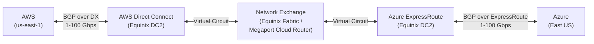
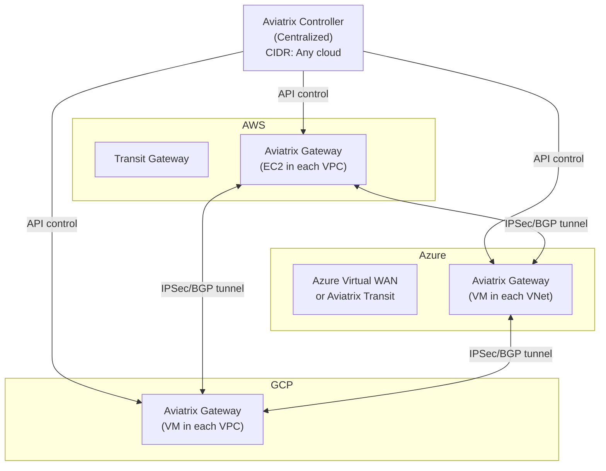

# Cross-Cloud Connectivity Guide

**Author:** Moussa El Najmi, Senior AWS Solutions Architect  
**Scope:** AWS ↔ Azure, AWS ↔ GCP, SD-WAN overlays, multi-cloud routing

---

## Table of Contents

1. [Why Cross-Cloud Connectivity Is Hard](#why-cross-cloud-connectivity-is-hard)
2. [AWS ↔ Azure Connectivity Options](#aws--azure-connectivity-options)
3. [AWS ↔ GCP Connectivity Options](#aws--gcp-connectivity-options)
4. [SD-WAN Overlay with Aviatrix](#sd-wan-overlay-with-aviatrix)
5. [Multi-Cloud Routing Considerations](#multi-cloud-routing-considerations)
6. [Latency Reference Data](#latency-reference-data)
7. [Security Considerations](#security-considerations)
8. [When NOT to Go Multi-Cloud](#when-not-to-go-multi-cloud)
9. [FAQ](#faq)

---

## Why Cross-Cloud Connectivity Is Hard

Within a single cloud provider, connectivity is an orchestrated service — TGW, VPC peering, and PrivateLink are managed by the cloud's control plane. Cross-cloud connectivity requires bridging two independent control planes, two BGP routing domains, and physically distinct networks.

**The three challenges:**

1. **Physical layer:** AWS and Azure are separate physical networks. Unless you're in the same colocation facility (Equinix, Digital Realty, Megaport), traffic must traverse the internet or a carrier's MPLS/Metro backbone.

2. **Routing plane:** AWS advertises CIDR prefixes via BGP over Direct Connect. Azure advertises prefixes via BGP over ExpressRoute. These two routing sessions exist independently — you must explicitly import/export routes between them, typically at a network exchange point.

3. **IP address management:** AWS VPC CIDRs and Azure VNet CIDRs must not overlap. In practice, organizations that have been operating in both clouds for years frequently have overlapping ranges that cannot be changed without downtime. This is the most common blocker to cross-cloud connectivity.

> **Why does CIDR overlap matter more in cross-cloud than in single-cloud?**
> Within AWS, TGW blackhole routes can prevent routing to overlapping CIDRs. Across clouds, you're dealing with BGP and physical routers that will accept the more-specific route regardless of intent. If AWS 10.1.0.0/16 and Azure 10.1.0.0/16 both appear in a routing table, routing becomes nondeterministic — some traffic goes to AWS, some to Azure, and both systems receive traffic not intended for them. There is no equivalent of "blackhole" in multi-cloud BGP.

---

## AWS ↔ Azure Connectivity Options

### Option 1: Direct Connect + ExpressRoute via Exchange Provider

**The production-grade solution for enterprise cross-cloud connectivity.**



**How it works:**
1. AWS Direct Connect connection at an exchange co-lo (e.g., Equinix Ashburn, VA)
2. Azure ExpressRoute connection at the same exchange
3. An exchange service (Equinix Fabric, Megaport, PacketFabric) creates a virtual circuit connecting the two
4. AWS VGW/TGW peers BGP with the exchange router
5. Azure ExpressRoute Gateway peers BGP with the exchange router
6. Routes are exchanged: AWS CIDRs appear in Azure route tables and vice versa

**Partners for this connection:**
- [Equinix Fabric](https://www.equinix.com/interconnection-services/equinix-fabric) — most common, present in 200+ colocation facilities
- [Megaport Cloud Router (MCR)](https://www.megaport.com/products/megaport-cloud-router/) — virtual routing, no physical hardware required
- [PacketFabric](https://packetfabric.com/) — cloud-native approach, API-driven
- [Cologix](https://www.cologix.com/), [CoreSite](https://www.coresite.com/) — regional exchanges

**Bandwidth options:** 50 Mbps to 100 Gbps per circuit  
**Latency:** 5-15ms within same metro (e.g., AWS + Azure in Northern Virginia both peer at Equinix Ashburn)  
**Cost:** Exchange port + circuit fees ($300-$2,000/month) + AWS DX + Azure ExpressRoute charges

> **Why use an exchange provider instead of VPN over internet?**
> Three reasons: (1) **Performance** — Exchange connections use private MPLS/Metro Ethernet with guaranteed bandwidth and no public internet contention. (2) **SLA** — AWS Direct Connect offers 99.9-99.95% uptime SLA; internet VPN has no SLA. (3) **Security compliance** — HIPAA, PCI-DSS, and SOC2 often require private (non-internet) connectivity for data in transit between cloud environments.

### Option 2: AWS Site-to-Site VPN ↔ Azure VPN Gateway

**The entry-level / backup option.**

```
AWS VGW ←──IPSec IKEv2──→ Azure VPN Gateway
```

**Configuration summary:**
- AWS creates a Customer Gateway pointing to Azure VPN GW public IP
- AWS creates a VPN Connection (IKEv2, BGP)
- Azure creates Local Network Gateway pointing to AWS VGW public IP
- BGP session established over the tunnel
- AWS VPC CIDRs appear in Azure route table and vice versa

**Bandwidth:** ~1.25 Gbps maximum per VPN tunnel (AWS limit)  
**Latency:** 20-100ms depending on internet path  
**Cost:** AWS VPN connection ~$36/month + $0.05/GB; Azure VPN GW ~$140-$280/month depending on SKU  
**HA:** Use two VPN tunnels (AWS VPN provides 2 tunnels automatically) + BGP for failover

**Limitations:**
- Not suitable for >1 Gbps sustained throughput
- Latency varies with internet conditions
- No bandwidth guarantee
- BGP route limits (AWS VGW: 100 routes max)

**Use case:** Dev/test cross-cloud, DX failover path, quick proof-of-concept

### Option 3: AWS Transit Gateway ↔ Azure Virtual WAN

For enterprises already using Azure Virtual WAN (Microsoft's TGW equivalent), you can connect AWS TGW to Azure Virtual WAN via:

1. **IPSec VPN** between AWS TGW VPN attachment and Azure VWan VPN Hub  
2. **Exchange connectivity** (DX + ER via Megaport/Equinix) terminating at VWan

Azure Virtual WAN supports dynamic BGP over IPSec. Configure:
- AWS TGW: create a VPN attachment with `vpn_ecmp_support = enable`
- Azure Virtual WAN Hub: add VPN site pointing to AWS TGW's public IPs
- BGP ASNs must be unique on each side

**Maximum bandwidth:** ~20 Gbps aggregate per VWan Hub via IPSec (using multiple tunnels)

### Comparison Table

| Option | Bandwidth | Latency | Cost/month | SLA | Use case |
|---|---|---|---|---|---|
| DX + ER via Exchange | 1-100 Gbps | 5-15ms (same metro) | $500-$3,000+ | 99.9-99.95% | Production, regulated workloads |
| VPN (AWS ↔ Azure) | Up to 1.25 Gbps | 20-100ms | $180-$320 | Internet SLA | Dev/test, backup |
| Aviatrix Multi-Cloud | Line rate | 5-10ms additional | $3,000-$10,000+ | Appliance SLA | Unified control plane |
| TGW ↔ VWan | Up to 20 Gbps | 10-30ms | ~$500+ | Mixed | Existing VWan deployments |

---

## AWS ↔ GCP Connectivity Options

### Dedicated Interconnect + Direct Peering via Exchange

Same model as AWS ↔ Azure but using:
- **AWS Side:** Direct Connect connection at exchange facility
- **GCP Side:** [Dedicated Interconnect](https://cloud.google.com/network-connectivity/docs/interconnect/concepts/dedicated-overview) or [Partner Interconnect](https://cloud.google.com/network-connectivity/docs/interconnect/concepts/partner-overview) at same exchange
- **Exchange:** Equinix Fabric, Megaport, or Google's own interconnect partners

**Key difference from Azure:** GCP uses [Cloud Router](https://cloud.google.com/network-connectivity/docs/router/concepts/overview) for BGP peering, which has stricter route advertisement requirements. You must use [custom route advertisements](https://cloud.google.com/network-connectivity/docs/router/how-to/create-router) to control which GCP prefixes are advertised to AWS.

### HA VPN (GCP) + Site-to-Site VPN (AWS)

GCP's [HA VPN](https://cloud.google.com/network-connectivity/docs/vpn/concepts/overview) provides 99.99% SLA (vs standard VPN's 99.9%) using two tunnel pairs:

```
AWS VGW (2 public IPs)
  Tunnel 1A → GCP HA VPN Gateway Interface 0
  Tunnel 1B → GCP HA VPN Gateway Interface 0
  Tunnel 2A → GCP HA VPN Gateway Interface 1
  Tunnel 2B → GCP HA VPN Gateway Interface 1
```

BGP sessions run over each tunnel for automatic failover. AWS BGP ASN: 64512 / GCP BGP ASN: 65534 (example).

**Bandwidth per tunnel:** ~3 Gbps (GCP HA VPN limit, vs AWS's 1.25 Gbps)

### AWS ↔ GCP via Aviatrix

[Aviatrix](https://aviatrix.com/) deploys a software gateway in both AWS and GCP VPCs and creates encrypted tunnels between them with:
- Automatic BGP route exchange
- High Performance Encryption (HPE) — ECMP across multiple tunnels
- Unified network visibility in Aviatrix Controller
- InsaneMode for 10+ Gbps throughput

---

## SD-WAN Overlay with Aviatrix

[Aviatrix](https://aviatrix.com/) is the most widely deployed multi-cloud network controller for enterprises needing a unified control plane across AWS, Azure, GCP, and on-premises.

### Architecture



### What Aviatrix Provides

| Feature | Without Aviatrix | With Aviatrix |
|---|---|---|
| Multi-cloud routing | Manual BGP config per cloud | Unified controller, auto BGP |
| Encryption | Per-cloud VPN primitives | End-to-end IPSec with InsaneMode (25 Gbps+) |
| Route policy | Per-cloud route tables | Centralized route intent policies |
| Visibility | CloudWatch + Azure Monitor + GCP Logging (silos) | Single Aviatrix CoPilot dashboard |
| FQDN filtering | NFW (AWS), NSG (Azure) separately | Unified egress FQDN policy |
| Troubleshooting | Per-cloud flow logs | Aviatrix FlightPath traceroute |

### Cost of Aviatrix

Aviatrix uses a software licensing model. At enterprise scale:
- Aviatrix Secure Networking Platform: starts at ~$3,000-$5,000/month for a mid-size deployment
- Gateway instances: standard EC2/VM costs (e.g., c5.xlarge ~$140/month each)
- Typical enterprise deployment (AWS + Azure, 10+ gateways): $8,000-$20,000/month total

This is justified when you have 5+ clouds/accounts, need unified policy, or have complex routing requirements that would take weeks to maintain manually.

---

## Multi-Cloud Routing Considerations

### BGP Design

```
Autonomous System layout (example):
  AWS TGW:          AS 64512
  Azure VWan:       AS 65515 (Azure default)
  GCP Cloud Router: AS 65534
  On-premises:      AS 65001
  Exchange/MCR:     AS 133937 (Megaport example)
```

**Rules:**
1. Every AS must be unique — overlapping ASNs cause BGP route loops
2. Private ASN range (64512-65534) is fine for internal use
3. If interconnecting with public internet peers, use public ASN
4. Use `as-path prepend` to make one path less preferred (primary/backup)

### CIDR Overlap Prevention

Before connecting clouds, audit all CIDR ranges:

```bash
# AWS: list all VPC CIDRs across all regions
aws ec2 describe-vpcs --query 'Vpcs[].CidrBlock' --output text --region us-east-1
aws ec2 describe-vpcs --query 'Vpcs[].CidrBlock' --output text --region eu-west-1

# Azure (PowerShell)
Get-AzVirtualNetwork | Select-Object Name, @{N='CIDR';E={$_.AddressSpace.AddressPrefixes}}

# GCP
gcloud compute networks subnets list --format="value(ipCidrRange)"
```

Common overlap issues:
- Both AWS and Azure using `10.0.0.0/8` without sub-allocation planning
- Default VPCs in AWS (172.31.0.0/16) overlapping with Azure default VNet (10.0.0.0/16)
- Legacy on-premises `192.168.0.0/16` overlapping with developer VPNs

### Route Filtering

Even with non-overlapping CIDRs, route leakage between clouds can expose sensitive subnets. Apply explicit route filters:

```
# AWS TGW: Export only specific prefixes to Azure
# (Configure at TGW or VGW level via BGP prefix list)
Route policy: Permit 10.1.0.0/16, 10.3.0.0/16  ← Prod + Shared Services only
             Deny  10.2.0.0/16                  ← Never export Dev to Azure
             Deny  0.0.0.0/0

# Azure: Accept only expected AWS prefixes
Route filter: Permit 10.1.0.0/16, 10.3.0.0/16
             Deny  default route from AWS
```

---

## Latency Reference Data

Based on typical observed latencies for 2024-2025. These are guidance values — actual latency depends on the specific facility, time of day, and circuit quality.

### Same-Region Latency (Primary Use Case)

| Connection | Type | Typical Latency | Notes |
|---|---|---|---|
| AWS us-east-1 ↔ Azure East US (via Equinix Ashburn) | DX + ER | 3-8ms | Both in Northern Virginia area |
| AWS eu-west-1 ↔ Azure West Europe (via Equinix Amsterdam) | DX + ER | 5-12ms | AWS in Dublin, Azure in Amsterdam |
| AWS ap-southeast-1 ↔ Azure Southeast Asia (via Equinix SG) | DX + ER | 3-7ms | Both in Singapore |
| AWS us-east-1 ↔ GCP us-east1 (via Megaport) | DX + Partner | 5-10ms | Both in eastern US |

### Cross-Region / Internet-Path Latency

| Connection | Type | Typical Latency | Notes |
|---|---|---|---|
| AWS us-east-1 ↔ Azure EU West (internet VPN) | VPN | 80-120ms | Cross-Atlantic internet path |
| AWS us-east-1 ↔ Azure East US (internet VPN) | VPN | 20-50ms | Same metro but internet path |
| Any cross-cloud via Aviatrix HPE | IPSec tunnels | +3-5ms over underlying path | Encryption overhead |

### AWS Internal Latency (Baseline)

| Connection | Latency |
|---|---|
| Same AZ, same VPC | <0.1ms |
| Cross-AZ, same region, via TGW | 0.5-1ms |
| TGW + Network Firewall (hub-spoke) | 1-3ms additional |
| AWS Direct Connect (to exchange) | 1-3ms |

> **Why do latency numbers vary so much for the same-region cross-cloud path?**
> "Same region" for AWS and Azure does not mean the same building. AWS us-east-1 spans data centers across Northern Virginia (Ashburn, Manassas, Boydton). Azure East US also spans Northern Virginia. The physical distance between specific facilities can be 5-30 miles, and fiber routing is not always direct. An exchange co-lo (like Equinix DC2 in Ashburn) that both clouds physically connect to is the optimal meeting point — it minimizes the fiber path to <1 mile in each direction.

---

## Security Considerations for Cross-Cloud Traffic

### Encryption in Transit

All cross-cloud traffic travels over third-party infrastructure (exchange providers, carrier MPLS, or the internet). Treat it as untrusted regardless of the "private" circuit designation:

| Layer | Control |
|---|---|
| **Transport** | IPSec encryption on all VPN tunnels (AES-256-GCM) |
| **Application** | mTLS for all service-to-service calls (never rely on network encryption alone) |
| **Data** | TLS 1.2+ for all API/database connections |

**WHY mTLS in addition to IPSec?**
An IPSec tunnel between AWS and Azure means the tunnel endpoints are trusted — but any workload behind those endpoints can use the tunnel. mTLS provides workload-identity-level authentication: the DB in Azure only accepts connections from the specific app in AWS that presents the correct client certificate, not any host that can reach the tunnel.

### Firewall Policy for Cross-Cloud Traffic

Deploy dedicated firewall policies for cross-cloud traffic, separate from intra-cloud east-west policies:

```
Cross-cloud traffic policy (AWS Network Firewall or Aviatrix FQDN):
  Allow: app-servers (AWS) → api.partner-azure.corp.internal (Azure) TCP/443
  Allow: data-pipeline (AWS) → azure-sql.corp.internal (Azure) TCP/1433
  Deny: default (all other cross-cloud traffic)
```

Do not include cross-cloud CIDRs in your "trusted internal" rule sets. A compromise on the Azure side should not be treated as a trusted internal event on the AWS side.

### IAM / RBAC Alignment

There is no native identity federation between AWS IAM and Azure AD for workload-to-workload calls. Use:
- [AWS Cognito Identity Federation](https://docs.aws.amazon.com/cognito/latest/developerguide/external-identity-providers.html) or OIDC tokens for API calls
- [Azure Managed Identity](https://learn.microsoft.com/en-us/azure/active-directory/managed-identities-azure-resources/overview) on Azure side
- Short-lived tokens exchanged at the application layer — not long-lived shared secrets

---

## When NOT to Go Multi-Cloud

> **Multi-cloud is a business decision with significant engineering costs. Be honest about the trade-offs.**

| Reason cited | Reality check |
|---|---|
| "Avoid vendor lock-in" | AWS-specific services (DynamoDB, SQS, EKS) are already vendor-locked. Moving to multi-cloud adds operational complexity without removing lock-in unless you fundamentally change your architecture. |
| "Use the best service from each cloud" | Each service integration requires its own connectivity, IAM translation, and operational runbook. Five services across three clouds = 15 integration points to maintain. |
| "Disaster recovery to another cloud" | Multi-region within AWS (us-east-1 + us-west-2) is cheaper, faster, and better-tested than cross-cloud DR. Cross-cloud DR adds months of engineering for a scenario that has never occurred for major cloud providers. |
| "Regulatory requirement for data residency" | AWS has 33 regions. Regulatory data residency requirements are almost always satisfiable within a single cloud provider's portfolio. |
| "Negotiate better pricing" | Using multiple clouds does not inherently improve pricing. Volume discounts require commitment to a single provider. |

**Legitimate reasons to go multi-cloud:**
- Specific SaaS product runs only on Azure (e.g., Microsoft 365 data integration)
- Acquired company's infrastructure is in GCP and migration cost is prohibitive
- Specific government customer requires Azure GovCloud AND AWS GovCloud
- A specific service genuinely has no equivalent elsewhere (e.g., Google BigQuery + AWS S3 for a specific analytics pattern)

---

## FAQ

**Q: What is the cheapest way to connect AWS and Azure for a proof-of-concept?**  
A: AWS Site-to-Site VPN to Azure VPN Gateway using BGP. Total monthly cost: ~$180-320. Setup time: 2-4 hours. Bandwidth: up to 1.25 Gbps. This is not production-grade (latency varies, no bandwidth SLA) but is sufficient for POC and dev/test cross-cloud connectivity. See the [AWS VPN documentation](https://docs.aws.amazon.com/vpn/latest/s2svpn/VPC_VPN.html).

**Q: Can I use AWS Direct Connect to reach both Azure and GCP?**  
A: Yes, via a **network exchange provider**. Equinix Fabric, Megaport, and PacketFabric support multi-cloud connectivity from a single colocation facility. You deploy one Direct Connect at the exchange, one Azure ExpressRoute at the same exchange, one GCP Dedicated Interconnect, and the exchange's routing service connects all three. This "single wire to exchange" model is more cost-effective than deploying separate DX connections for each cloud relationship.

**Q: How do I handle the case where AWS and Azure have overlapping CIDRs?**  
A: You have three options, in order of preference: (1) Re-CIDR the Azure VNets (painful but correct — use Azure's [VNet address space migration](https://learn.microsoft.com/en-us/azure/virtual-network/virtual-network-manage-network) during maintenance windows). (2) Deploy NAT on the exchange/connectivity layer to translate one side's addresses (adds complexity and breaks path MTU discovery). (3) Use Aviatrix's [CIDR-less routing](https://docs.aviatrix.com/documentation/latest/network-address-translation/aviatrix-site2cloud-and-nat.html) which performs per-packet NAT between clouds — most expensive but avoids any re-CIDR work. Option 1 is always preferred for new deployments — fix the root cause.

**Q: What BGP route limits should I be aware of for cross-cloud connections?**  
A: AWS Transit Gateway: 1,000 routes per route table (soft limit, can be raised). AWS VGW (without TGW): 100 routes. Azure ExpressRoute: 4,000 routes per ExpressRoute circuit. GCP Cloud Router: 1,000 dynamic routes per region per VPC. In multi-cloud BGP, the most restrictive limit applies. For large environments with many VPCs, use route summarization (supernetting) at the exchange: advertise `10.1.0.0/14` (covers 10.1-10.3.x.x) instead of individual /16s.

**Q: Should I use Aviatrix, AWS Cloud WAN, or native TGW for multi-cloud?**  
A: It depends on your scale and existing investment. **AWS Cloud WAN** is AWS-native and excellent for AWS-only multi-region networking — it doesn't manage Azure or GCP. **Native TGW** is the right starting point for pure-AWS architectures. **Aviatrix** becomes the right choice when: you have 3+ clouds, need unified policy management, want single-pane-of-glass visibility, or have SD-WAN requirements. Aviatrix's control plane (Controller) is deployed in AWS but manages all clouds. The additional cost (~$5,000-$15,000/month for mid-enterprise) is justified when it replaces manual management of complex BGP configurations across multiple clouds. See [AWS Cloud WAN vs TGW comparison](https://docs.aws.amazon.com/network-manager/latest/cloudwan/cloudwan-vs-tgw.html).
