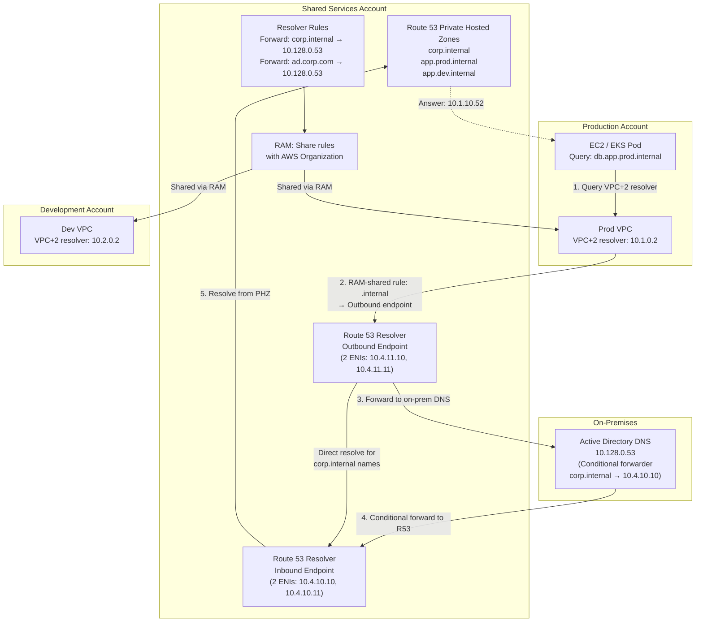

# Enterprise DNS Architecture on AWS

**Author:** Moussa El Najmi, Senior AWS Solutions Architect  
**Scope:** Multi-account, hybrid (on-premises + AWS) DNS architecture

---

## Table of Contents

1. [Why DNS Architecture Matters](#why-dns-architecture-matters)
2. [Centralized DNS Account Pattern](#centralized-dns-account-pattern)
3. [Route 53 Resolver Endpoints](#route-53-resolver-endpoints)
4. [Private Hosted Zones (PHZ) Across Accounts](#private-hosted-zones-across-accounts)
5. [Forwarding Rules to On-Premises](#forwarding-rules-to-on-premises)
6. [Split-Brain DNS](#split-brain-dns)
7. [DNS for EKS (CoreDNS + Custom Rules)](#dns-for-eks)
8. [FAQ](#faq)

---

## Why DNS Architecture Matters

DNS is the first step in every network connection. Misconfigured DNS causes:
- Application failures that look like network issues (misdiagnosed for hours)
- Split resolution where some accounts resolve internal hostnames and others cannot
- Latency from DNS queries traversing the internet instead of staying on AWS's backbone
- Security gaps when internal service names resolve to public IPs instead of private ones

> **Why not just put a DNS server in each VPC?**
> In a multi-account AWS environment, you might have 20+ VPCs across prod, dev, staging, and shared services. Maintaining a DNS resolver in each VPC means 20+ resolver configurations to manage, 20+ sets of forwarding rules to keep synchronized, and 20+ blast radii for a misconfiguration. A centralized model manages it once and shares across all accounts via AWS Organizations.

---

## Centralized DNS Account Pattern

The authoritative DNS infrastructure lives in the **Shared Services account**, typically alongside Active Directory (if used) and other organization-wide services.



### Account Structure

| Account | DNS Role | Resources |
|---|---|---|
| **Shared Services** | DNS authority | Inbound + Outbound Resolver endpoints, PHZs for all domains, Resolver rules shared via RAM |
| **Prod, Dev, Staging** | DNS consumers | VPC-associated PHZs (via RAM), imported Resolver rules (via RAM) |
| **On-premises** | Corporate DNS | AD-integrated DNS, conditional forwarder pointing to R53 Inbound endpoint |

---

## Route 53 Resolver Endpoints

### Inbound Endpoint

Accepts DNS queries from **outside the VPC** (on-premises systems) and resolves them using Route 53 Private Hosted Zones and VPC DNS.

```
On-premises DNS server
  → Conditional forwarder: *.aws.corp.internal → 10.4.10.10
  → Route 53 Inbound Endpoint (10.4.10.10)
  → Resolves from Private Hosted Zone
  → Returns: 10.1.10.52 (private IP of the AWS resource)
```

**Configuration:**
- Deploy in **2 subnets across 2+ AZs** for HA (minimum requirement)
- Each AZ gets one ENI with a fixed IP from the resolver subnet
- Use the same IP addresses in on-premises conditional forwarders — they don't change
- Inbound endpoint supports up to **10,000 queries per second per IP**

```hcl
resource "aws_route53_resolver_endpoint" "inbound" {
  name      = "centralized-dns-inbound"
  direction = "INBOUND"

  security_group_ids = [aws_security_group.resolver_inbound.id]

  ip_address {
    subnet_id = aws_subnet.resolver_a.id
    ip        = "10.4.10.10"  # Fixed IP — configure on on-prem DNS as forwarder target
  }

  ip_address {
    subnet_id = aws_subnet.resolver_b.id
    ip        = "10.4.10.11"  # Second AZ for HA
  }

  tags = { Name = "centralized-dns-inbound" }
}
```

> **Why use fixed IPs for the inbound endpoint?**
> On-premises DNS servers must be configured with the IP address of the inbound endpoint as the forwarding target. If the IP changes (e.g., after a destroy/recreate), the on-premises DNS breaks and no AWS resources are reachable by name from on-prem. Fixed IPs eliminate this operational risk.

### Outbound Endpoint

Routes DNS queries **from within VPCs** to external destinations (on-premises DNS, third-party DNS) based on Resolver Rules.

```
EC2 in Prod VPC
  → Queries VPC+2 resolver (10.1.0.2)
  → Resolver rule matches: corp.ad.com → forward to outbound endpoint
  → Outbound endpoint (10.4.11.10) → On-premises DNS (10.128.0.53)
  → Returns: 10.128.5.22 (on-prem server IP)
```

**Security Group requirements:**

```hcl
resource "aws_security_group" "resolver_outbound" {
  name   = "resolver-outbound-sg"
  vpc_id = aws_vpc.shared_services.id

  egress {
    description = "DNS UDP to on-premises"
    from_port   = 53
    to_port     = 53
    protocol    = "udp"
    cidr_blocks = ["10.128.0.0/9"]  # On-premises CIDR
  }

  egress {
    description = "DNS TCP to on-premises (for large responses)"
    from_port   = 53
    to_port     = 53
    protocol    = "tcp"
    cidr_blocks = ["10.128.0.0/9"]
  }
}
```

---

## Private Hosted Zones (PHZ) Across Accounts

A Private Hosted Zone resolves DNS names only within VPCs that are associated with it. In a multi-account setup:

1. **PHZs are created in the Shared Services account** — central management
2. **Associations are made to VPCs in other accounts** using cross-account PHZ association
3. **RAM does not directly share PHZs** — you use Route 53 API calls to create cross-account associations

### Cross-Account PHZ Association Process

```bash
# Step 1: In the Shared Services account (PHZ owner):
# Get the PHZ ID
PHZ_ID="Z1234567890ABC"

# Authorize the Prod account's VPC to associate
aws route53 create-vpc-association-authorization \
  --hosted-zone-id $PHZ_ID \
  --vpc VPCRegion=us-east-1,VPCId=vpc-0123456789abcdef0 \
  --region us-east-1

# Step 2: In the Prod account (VPC owner):
# Create the association
aws route53 associate-vpc-with-hosted-zone \
  --hosted-zone-id $PHZ_ID \
  --vpc VPCRegion=us-east-1,VPCId=vpc-0123456789abcdef0 \
  --region us-east-1
```

**Terraform for cross-account PHZ association:**

```hcl
# In Shared Services account Terraform
resource "aws_route53_vpc_association_authorization" "prod" {
  zone_id = aws_route53_zone.internal.id
  vpc_id  = var.prod_vpc_id  # Passed from prod account
  vpc_region = var.aws_region
}

# In Prod account Terraform
resource "aws_route53_zone_association" "internal" {
  zone_id = var.internal_phz_id  # From shared services outputs
  vpc_id  = aws_vpc.prod.id
  vpc_region = var.aws_region
}
```

### PHZ Architecture Example

```
Private Hosted Zones (all created in Shared Services account):
├── corp.internal            → All AWS internal resources (catch-all)
│   ├── api.corp.internal    → CNAME → internal ALB
│   └── db.corp.internal     → CNAME → RDS endpoint
├── prod.aws.corp.internal   → Production resources
│   ├── app.prod.aws.corp.internal   → 10.1.10.52
│   └── db.prod.aws.corp.internal    → 10.1.20.10
└── dev.aws.corp.internal    → Development resources
    └── app.dev.aws.corp.internal    → 10.2.10.52

Associated VPCs:
  corp.internal          → Prod VPC, Dev VPC, Staging VPC, Shared Services VPC
  prod.aws.corp.internal → Prod VPC only
  dev.aws.corp.internal  → Dev VPC only
```

---

## Forwarding Rules to On-Premises

Route 53 Resolver Rules define which domains should be forwarded to which DNS servers via the Outbound endpoint.

```hcl
# Forward corporate Active Directory domain to on-prem DNS
resource "aws_route53_resolver_rule" "corp_ad" {
  domain_name          = "corp.ad.company.com"
  name                 = "forward-corp-ad"
  rule_type            = "FORWARD"
  resolver_endpoint_id = aws_route53_resolver_endpoint.outbound.id

  target_ip {
    ip   = "10.128.0.53"  # Primary on-prem DNS
    port = 53
  }

  target_ip {
    ip   = "10.128.0.54"  # Secondary on-prem DNS (HA)
    port = 53
  }

  tags = { Name = "forward-corp-ad" }
}

# Share the rule with the entire AWS Organization via RAM
resource "aws_ram_resource_share" "dns_rules" {
  name                      = "shared-dns-resolver-rules"
  allow_external_principals = false  # Organization-only sharing

  tags = { Name = "shared-dns-resolver-rules" }
}

resource "aws_ram_resource_association" "dns_rule_corp_ad" {
  resource_arn       = aws_route53_resolver_rule.corp_ad.arn
  resource_share_arn = aws_ram_resource_share.dns_rules.arn
}

resource "aws_ram_principal_association" "org" {
  principal          = var.aws_organization_arn  # e.g., "arn:aws:organizations::123456789:organization/o-xxxx"
  resource_share_arn = aws_ram_resource_share.dns_rules.arn
}
```

Once shared, spoke account VPCs **associate the rule** with their VPC:

```hcl
# In spoke account Terraform
resource "aws_route53_resolver_rule_association" "corp_ad" {
  resolver_rule_id = var.corp_ad_rule_id  # From shared services outputs
  vpc_id           = aws_vpc.prod.id
}
```

### Forwarding Rule Types

| Rule type | Behavior | When to use |
|---|---|---|
| `FORWARD` | Send matching queries to specified target IPs | On-premises DNS, third-party resolvers |
| `SYSTEM` | Use Route 53's built-in resolver (default AWS behavior) | Override FORWARD rules for specific subdomains |
| `RECURSIVE` | Standard recursive resolution | Rarely used explicitly — it's the default |

---

## Split-Brain DNS

Split-brain (also called split-horizon) DNS serves **different answers for the same hostname** depending on where the query originates:

| Query source | Hostname | Answer |
|---|---|---|
| On-premises / internet | `api.company.com` | `52.1.2.3` (public ALB IP, via Route 53 public zone) |
| AWS VPC (internal) | `api.company.com` | `10.1.10.52` (private ALB IP, via Route 53 PHZ) |

### Implementation

1. **Public Hosted Zone** (Route 53 public): `api.company.com → 52.1.2.3`
2. **Private Hosted Zone** (Route 53 private, associated with VPCs): `api.company.com → 10.1.10.52`

When an EC2 instance queries `api.company.com`, the VPC resolver checks the associated PHZ first. If it finds a match, that answer is returned — the public zone is never queried. This is the default behavior when PHZs are associated with a VPC.

```hcl
# Public Hosted Zone (resolves for internet traffic)
resource "aws_route53_record" "api_public" {
  zone_id = aws_route53_zone.public.zone_id
  name    = "api.company.com"
  type    = "A"

  alias {
    name                   = aws_lb.public_alb.dns_name
    zone_id                = aws_lb.public_alb.zone_id
    evaluate_target_health = true
  }
}

# Private Hosted Zone (resolves for internal traffic — same domain, different answer)
resource "aws_route53_record" "api_private" {
  zone_id = aws_route53_zone.private_internal.zone_id  # Associated with VPCs
  name    = "api.company.com"
  type    = "A"

  alias {
    name                   = aws_lb.internal_alb.dns_name
    zone_id                = aws_lb.internal_alb.zone_id
    evaluate_target_health = true
  }
}
```

> **Why split-brain DNS instead of just using the public IP internally?**
> Two reasons: (1) **Cost** — traffic from an EC2 to a public IP in the same region exits to the internet and re-enters, traversing NAT Gateway and incurring data processing charges. Internal IP keeps traffic within AWS. (2) **Security** — internal traffic should take internal paths. Routing application-to-application traffic via the public internet adds unnecessary attack surface and latency.

---

## DNS for EKS

### CoreDNS

EKS includes [CoreDNS](https://kubernetes.io/docs/tasks/administer-cluster/coredns/) as the cluster DNS resolver. CoreDNS handles:
- Service discovery within the cluster (`my-service.my-namespace.svc.cluster.local`)
- Pod-to-pod DNS (`pod-ip.namespace.pod.cluster.local`)
- External DNS forwarding (queries for non-cluster names go to the VPC+2 resolver)

### Default Resolution Path

```
Pod queries: api.company.com
  → CoreDNS (10.100.0.10 — kube-dns Service ClusterIP)
  → CoreDNS: not a cluster domain (.cluster.local / .svc / .pod)
  → Forward to VPC+2 resolver (10.1.0.2 — VPC DNS)
  → VPC resolver: check Resolver Rules
  → Match: api.company.com → on-premises DNS (via Outbound Endpoint)
  → Answer: 10.128.5.22 returned to pod
```

### Custom CoreDNS Forwarding Rules

Add custom forwarding rules in the CoreDNS ConfigMap to override the default upstream path for specific domains:

```yaml
# kubectl edit configmap coredns -n kube-system
apiVersion: v1
kind: ConfigMap
metadata:
  name: coredns
  namespace: kube-system
data:
  Corefile: |
    .:53 {
        errors
        health {
            lameduck 5s
        }
        ready
        
        # Cluster-internal DNS
        kubernetes cluster.local in-addr.arpa ip6.arpa {
            pods insecure
            fallthrough in-addr.arpa ip6.arpa
            ttl 30
        }
        
        # Forward corp.internal to on-prem DNS directly from CoreDNS
        # (bypasses VPC resolver for faster resolution)
        corp.internal:53 {
            forward . 10.128.0.53 10.128.0.54
            cache 30
        }
        
        # Forward everything else to VPC DNS (which has Resolver Rules)
        forward . /etc/resolv.conf {
            max_concurrent 1000
        }
        
        cache 30
        loop
        reload
        loadbalance
    }
```

### NodeLocal DNSCache

For high-query-rate EKS clusters, deploy [NodeLocal DNSCache](https://kubernetes.io/docs/tasks/administer-cluster/nodelocaldns/) to reduce DNS latency and CoreDNS load:

- Runs as a DaemonSet on every node
- Intercepts DNS queries before they reach CoreDNS
- Caches responses locally on the node
- Reduces CoreDNS query volume by 60-80%
- Reduces DNS latency from ~2ms to ~0.1ms for cached entries

```bash
# Deploy NodeLocal DNSCache on EKS
# Reference: https://github.com/kubernetes/kubernetes/tree/master/cluster/addons/dns/nodelocaldns
kubectl apply -f nodelocaldns.yaml
```

> **Why is DNS latency an issue for EKS?**
> In a microservices architecture, a single user request may trigger dozens of service-to-service calls, each requiring one or more DNS lookups. At 2ms per DNS query and 20 internal calls per request, DNS alone contributes 40ms of latency. NodeLocal DNSCache reduces this to under 2ms total — a meaningful improvement for user-facing latency SLOs.

---

## FAQ

**Q: Can I use a custom DNS server (e.g., Windows AD DNS) as the resolver for all VPC queries?**  
A: Yes, but it's complex and fragile. You would need to set `dhcp_options` on the VPC to point to your AD DNS server instead of the VPC+2 resolver. The AD server must be highly available (multiple replicas across AZs), low latency, and able to forward AWS-specific queries (`.amazonaws.com`, `.ec2.internal`) back to Route 53. This approach breaks VPC endpoints private DNS, EKS internal DNS, and requires on-prem connectivity for every DNS query. Strongly prefer Route 53 Resolver endpoints which keep AWS DNS native while adding hybrid forwarding on top.

**Q: What is the Route 53 Resolver query limit and how do I increase it?**  
A: Each Resolver endpoint IP address supports up to **10,000 queries per second**. With 2 IPs per endpoint (minimum), you get 20,000 QPS. For very large EKS clusters, deploy [NodeLocal DNSCache](https://kubernetes.io/docs/tasks/administer-cluster/nodelocaldns/) to reduce upstream resolver load. If you exceed 10,000 QPS per IP, add more IP addresses to the endpoint (each additional IP costs an extra $0.125/hour per AZ). See [Resolver quotas](https://docs.aws.amazon.com/Route53/latest/DeveloperGuide/DNSLimitations.html).

**Q: How do I resolve AWS service endpoints (e.g., s3.amazonaws.com) from on-premises?**  
A: Configure the on-premises DNS with a conditional forwarder: `amazonaws.com → Route 53 Inbound Endpoint IPs (10.4.10.10, 10.4.10.11)`. When on-premises systems query `s3.us-east-1.amazonaws.com`, the request arrives at the Inbound Endpoint, which resolves it using VPC DNS — returning the VPC endpoint IP if one exists, or the public S3 IP otherwise.

**Q: What happens to DNS if the Shared Services VPC is unavailable?**  
A: DNS resolution across all VPCs that depend on forwarding rules will fail for on-premises queries and cross-account internal queries. Within a single VPC, the VPC+2 resolver continues to work for locally associated PHZs. Mitigations: (1) deploy Inbound and Outbound endpoints across 3 AZs (endpoints are deployed in 2+ AZs by default), (2) configure redundant on-premises DNS servers as targets, (3) cache-heavy DNS TTLs (300-3600 seconds) for stable records.

**Q: How do I debug DNS resolution failures in AWS?**  
A: (1) Enable [Route 53 Resolver query logging](https://docs.aws.amazon.com/Route53/latest/DeveloperGuide/resolver-query-logs.html) — logs every DNS query made by resources in the VPC to S3 or CloudWatch Logs. (2) Check VPC DHCP options (`aws ec2 describe-dhcp-options --dhcp-options-ids`) to confirm the VPC uses AmazonProvidedDNS. (3) Test from the failing instance: `nslookup hostname 10.1.0.2` (using VPC+2 resolver explicitly). (4) Check Resolver Rule associations: `aws route53resolver list-resolver-rule-associations`.
