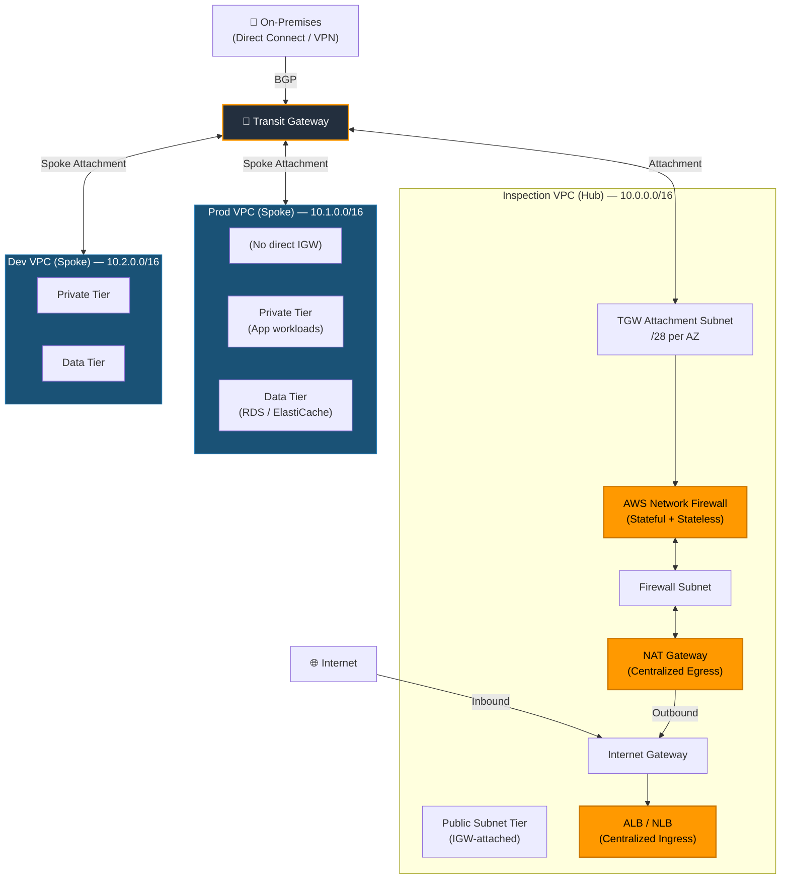
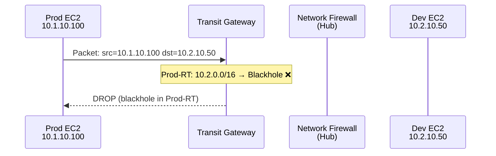
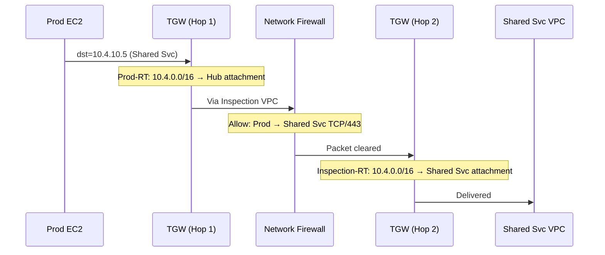

# Hub-and-Spoke Network Pattern

**Pattern:** Centralized Inspection with Transit Gateway  
**Author:** Moussa El Najmi, Senior AWS Solutions Architect  
**Complexity:** High | **Maturity:** Production-proven

---

## Table of Contents

1. [Pattern Overview](#pattern-overview)
2. [The Inspection VPC Pattern](#the-inspection-vpc-pattern)
3. [Centralized Egress (NAT Gateway in Hub)](#centralized-egress)
4. [Centralized Ingress (ALB/NLB in Hub)](#centralized-ingress)
5. [East-West Traffic Inspection Flow](#east-west-traffic-inspection-flow)
6. [When NOT to Use This Pattern](#when-not-to-use-this-pattern)
7. [Terraform Implementation](#terraform-implementation)
8. [FAQ](#faq)

---

## Pattern Overview



The hub-and-spoke pattern centralizes **all three network functions** in the hub VPC:
1. **Inspection** — AWS Network Firewall evaluates every packet
2. **Egress** — NAT Gateway in hub provides a single outbound IP pool
3. **Ingress** — ALB/NLB in hub terminates external connections before they reach workloads

Spoke VPCs contain only workloads. They have no Internet Gateways, no NAT Gateways, and no direct internet paths. All connectivity flows through TGW → Hub.

> **Why concentrate all three functions in one VPC?**
> Decentralization multiplies cost and policy surface area. If every spoke has its own NAT Gateway, you pay per-attachment-per-AZ (up to $0.045/hr each) and manage N egress IP pools. If every spoke has its own ALB, you manage N TLS certificates and N WAF configurations. Centralization trades a small amount of latency (one extra TGW hop, ~0.5ms) for dramatic simplification of operations, cost, and audit surface.

---

## The Inspection VPC Pattern

### Subnet Architecture

The inspection VPC uses **four subnet tiers** (more than a standard VPC) because traffic must flow through multiple logical stages:

```
Inspection VPC (10.0.0.0/16)
├── Public Subnets (10.0.0.0/24, 10.0.1.0/24, 10.0.2.0/24)
│   └── Internet Gateway attached
│   └── ALB, NAT Gateway EIPs live here
├── NAT Subnets (10.0.10.0/24, 10.0.11.0/24, 10.0.12.0/24)
│   └── NAT Gateways deployed here (one per AZ)
│   └── Route: 0.0.0.0/0 → IGW, 10.0.0.0/8 → TGW
├── Firewall Subnets (10.0.20.0/24, 10.0.21.0/24, 10.0.22.0/24)
│   └── AWS Network Firewall endpoints live here
│   └── Route: 0.0.0.0/0 → NAT GW (same AZ), 10.0.0.0/8 → TGW
└── TGW Attachment Subnets (10.0.255.0/28, 10.0.255.16/28, 10.0.255.32/28)
    └── TGW ENIs land here
    └── Route: ALL → NFW endpoint (same AZ) ← critical
```

> **Why a separate TGW attachment subnet tier?**
> The TGW attachment subnet's route table controls the first hop for all traffic arriving from spokes. By having a dedicated /28 subnet with a route table that sends everything to the NFW endpoint, you guarantee that **no traffic can bypass the firewall**. If the firewall endpoint and TGW attachment were in the same subnet, routing would be ambiguous and bypass would be possible.

### Traffic Insertion Points

AWS Network Firewall uses **VPC endpoint IDs** as route table targets (`vpce-xxxxxxxx`). The "bump in the wire" is created by:

1. Traffic arrives at TGW attachment subnet from spoke VPC
2. TGW attachment subnet route table: `0.0.0.0/0 → vpce-nfw-az1` (for AZ-1 attachment)
3. NFW inspects the packet against stateless + stateful rules
4. If allowed: NFW forwards to firewall subnet
5. Firewall subnet route table: `0.0.0.0/0 → nat-gateway-az1`
6. NAT Gateway translates and forwards to IGW → internet

### AZ-Affine Routing (Avoiding Asymmetric Traffic)

Each AZ must use its **own firewall endpoint**:

```
AZ-1:
  TGW Attachment Subnet AZ-1 route: 0.0.0.0/0 → vpce-nfw-endpoint-az1
  Firewall Subnet AZ-1 route: 0.0.0.0/0 → nat-gw-az1

AZ-2:
  TGW Attachment Subnet AZ-2 route: 0.0.0.0/0 → vpce-nfw-endpoint-az2
  Firewall Subnet AZ-2 route: 0.0.0.0/0 → nat-gw-az2

AZ-3:
  TGW Attachment Subnet AZ-3 route: 0.0.0.0/0 → vpce-nfw-endpoint-az3
  Firewall Subnet AZ-3 route: 0.0.0.0/0 → nat-gw-az3
```

> **What breaks if you use the wrong AZ's endpoint?**
> TCP connections will be asymmetrically inspected. The SYN goes through NFW endpoint AZ-1, but the SYN-ACK (return path) comes back through NFW endpoint AZ-2. NFW-AZ2 has no record of this connection and applies its default action (typically `DROP`). The symptom: connections appear to establish partially but immediately reset, with no application errors logged on either endpoint — making it extremely difficult to diagnose.

---

## Centralized Egress

### Architecture

All spoke VPC outbound internet traffic exits through a single pool of NAT Gateways in the hub VPC.

```
Prod EC2 → 0.0.0.0/0 → TGW (via Prod VPC private route table)
         → TGW Prod-RT: 0.0.0.0/0 → Inspection VPC attachment
         → Inspection VPC TGW attachment subnet
         → NFW endpoint (firewall inspection)
         → NAT Gateway (in public subnet)
         → Internet Gateway → Internet
```

### Benefits of Centralized NAT

| Benefit | Detail |
|---|---|
| **Cost** | One set of NAT Gateways (3 AZs × ~$0.045/hr) instead of per-VPC sets. At 5 spoke VPCs, saves ~$480/month. |
| **Single egress IP pool** | Third parties whitelist 3 IPs (one per AZ NAT GW EIP) instead of 3 × N IPs |
| **Unified egress monitoring** | All outbound traffic observable in one location |
| **Policy enforcement** | Domain allow/block lists apply once, not per VPC |

### NAT Gateway Cost Note

NAT Gateway pricing (us-east-1): `$0.045/hr + $0.045/GB processed`. One NAT GW per AZ (3 total) costs **$97.20/month** in hourly charges alone, before data processing. This is the cost for the **entire enterprise** egress path — compare to $97.20 × number-of-spoke-VPCs in a decentralized model.

For very high egress volumes (>10 TB/month), evaluate [NAT Instance on Graviton3](https://aws.amazon.com/blogs/networking-and-content-delivery/how-to-set-up-an-outbound-vpc-proxy-with-domain-whitelisting-and-content-filtering/) as a cost-optimized alternative.

---

## Centralized Ingress

### Architecture

External traffic enters the hub VPC through an Internet Gateway and terminates at an ALB or NLB before being forwarded to workloads in spoke VPCs.

```
Internet → IGW → ALB (in Hub Public Subnet)
                  │
                  ├─ Target Group → PrivateLink endpoint → Prod VPC
                  │  (or)
                  ├─ Target Group → Prod VPC ALB (via TGW)
                  └─ Target Group → IP addresses in Prod private subnets
```

**Two patterns for forwarding to spokes:**

1. **ALB → IP targets across TGW**: Register private IP addresses of spoke VPC resources as ALB targets. Works because ALB can target IPs in any routable CIDR. Traffic goes `Hub ALB → Hub private subnet → TGW → Prod VPC`.

2. **ALB → NLB via PrivateLink**: Expose spoke VPC services via [AWS PrivateLink](https://docs.aws.amazon.com/vpc/latest/privatelink/what-is-privatelink.html) (NLB-backed endpoint service). Hub ALB targets a VPC endpoint pointing to the spoke's NLB. Best for isolation — spoke VPC remains completely private and not reachable via TGW for this service.

> **Why not put the ALB directly in the spoke VPC?**
> A spoke-VPC ALB requires internet access to receive traffic, which means either an IGW (violates the "no direct internet in spokes" rule) or complex routing. Centralized ingress keeps IGW exposure to one VPC, enables a single WAF policy attached to one ALB, and provides centralized access logs for compliance.

### WAF Integration

[AWS WAF](https://docs.aws.amazon.com/waf/latest/developerguide/waf-chapter.html) attaches directly to the hub ALB:

```hcl
resource "aws_wafv2_web_acl_association" "hub_alb" {
  resource_arn = aws_lb.hub_alb.arn
  web_acl_arn  = aws_wafv2_web_acl.main.arn
}
```

All inbound requests pass through WAF rules (OWASP managed rules, rate limiting, geo-blocking) before reaching any spoke workload — without any configuration in spoke accounts.

---

## East-West Traffic Inspection Flow

### Same-Domain East-West (Dev → Dev)

Two workloads in the same spoke VPC communicate directly — no TGW traversal, no firewall. Security Groups control access.

### Cross-Domain East-West (Dev → Shared Services)

```
Dev EC2 (10.2.10.50)
  → Dev private subnet route: 10.4.0.0/16 → TGW
  → TGW NonProd-RT: 10.4.0.0/16 → Shared Services attachment (propagated)
  → Shared Services VPC private subnet
  → Application (e.g., Active Directory, internal tools)
```

Note: in the NonProd-RT, `10.1.0.0/16` (Prod) is blackholed — Dev cannot reach Prod even by routing to the TGW.

### Cross-Domain East-West Through Firewall (Any → Any, Inspection Required)

When east-west policy requires firewall inspection (e.g., for compliance or segmentation assurance):

```
Prod EC2 → TGW Prod-RT: 10.2.0.0/16 → Inspection VPC attachment
         → Inspection VPC TGW attachment subnet
         → NFW endpoint (east-west policy applied)
         → NFW allows → Firewall subnet
         → Firewall subnet route: 10.2.0.0/16 → TGW
         → TGW Inspection-RT: 10.2.0.0/16 → Dev VPC attachment
         → Dev VPC
```

The traffic makes **two TGW hops** when going through the firewall: spoke → hub → spoke. This is intentional. The hub is the mandatory inspection point.





---

## When NOT to Use This Pattern

> **The hub-and-spoke pattern has real costs. Not every architecture warrants it.**

| Scenario | Recommendation |
|---|---|
| **Single AWS account, 1-2 VPCs** | VPC peering is cheaper and simpler. TGW attachment costs $36/month each. |
| **Very low traffic (<1 GB/day)** | TGW data processing costs add up for high-traffic paths. Evaluate peering. |
| **No inspection requirement** | If compliance does not require network-level inspection, the firewall cost ($0.65/hr per AZ for the endpoint + $0.065/GB) may not be justified. |
| **Dev sandbox accounts** | Lightweight devs can use direct IGW access with Security Groups. Reserve the pattern for production and regulated workloads. |
| **Same-region, same-account EKS clusters** | Use Kubernetes NetworkPolicy (Calico/Cilium) for pod-level segmentation instead of routing all traffic through a central firewall. |
| **Startup / pre-product-market-fit** | The operational complexity of centralized inspection is a distraction at early stage. Start simple; migrate when regulatory or scale requirements emerge. |

**Rule of thumb:** Use hub-and-spoke when you have **3+ VPCs, production workloads, or regulatory inspection requirements**. Otherwise, VPC peering + Security Groups is sufficient and significantly cheaper.

---

## Terraform Implementation

The complete Terraform implementation is in [`terraform/`](./terraform/):

| File | Purpose |
|---|---|
| [`main.tf`](./terraform/main.tf) | Hub + spoke VPCs, TGW, Network Firewall, routing |
| [`variables.tf`](./terraform/variables.tf) | All input variables with defaults |
| [`outputs.tf`](./terraform/outputs.tf) | Key resource outputs |
| [`terraform.tfvars.example`](./terraform/terraform.tfvars.example) | Example variable values |

**Quick start:**

```bash
cd hub-spoke/terraform
cp terraform.tfvars.example terraform.tfvars
# Edit terraform.tfvars with your values
terraform init
terraform plan -out=tfplan
terraform apply tfplan
```

**Prerequisites:**
- AWS CLI configured with credentials for the Network account
- Terraform >= 1.5.0
- AWS provider >= 5.0

---

## FAQ

**Q: Can I add more spoke VPCs after initial deployment?**  
A: Yes. Create the new VPC and subnet resources, create a TGW attachment to the existing TGW, and associate the attachment with the appropriate TGW route table. The hub (inspection VPC) requires no changes. The only operational consideration is ensuring the new VPC's CIDR does not overlap with existing CIDRs — which is why pre-planning the entire CIDR space matters.

**Q: What happens if the Inspection VPC becomes unavailable?**  
A: All inter-spoke and internet traffic stops. The inspection VPC is a **single point of failure for connectivity** — though not for application uptime within a spoke VPC. Mitigations: (1) deploy firewall endpoints across all 3 AZs (NFW automatically fails over within AZs), (2) use NAT Gateways in all 3 AZs, (3) for on-premises failover, keep the VPN tunnel as a backup that bypasses the inspection VPC. AWS Network Firewall itself has a 99.99% SLA — the risk is typically misconfiguration, not service failure.

**Q: How do I handle spoke VPCs that need to talk to each other directly (high bandwidth, low latency)?**  
A: For spoke-to-spoke communication with high bandwidth requirements (e.g., data transfer between a Kafka cluster in one VPC and consumers in another), the two TGW hops add ~1ms latency and TGW data processing charges. Options: (1) Accept the overhead — 1ms is negligible for most workloads. (2) Add a direct VPC peering connection **only** between those two VPCs for that high-bandwidth path, while keeping the TGW for all other traffic. (3) Consolidate the communicating workloads into one VPC.

**Q: Should the hub VPC have workloads in it?**  
A: Strongly discouraged. The hub VPC serves a pure networking function — it inspects and routes traffic but should not run application workloads. Mixing workloads and network infrastructure in the hub VPC creates blast radius risk (a workload incident affecting the hub disrupts all network paths) and complicates security audit (the hub should have a minimal, predictable attack surface). The Shared Services VPC is a **separate** spoke VPC for shared tools like Active Directory, monitoring, and internal registries.

**Q: What are the latency implications of all this routing?**  
A: Each TGW hop adds approximately **0.5-1ms** of latency. North-south traffic (internet → spoke) adds one TGW hop plus NFW inspection (~0.2ms additional). East-west through the hub adds two TGW hops. Total latency overhead for hub-and-spoke vs direct connectivity: **1-3ms per connection setup**. For established TCP connections, the per-packet overhead is negligible. This is acceptable for virtually all enterprise workloads. Real-time financial trading or ultra-low-latency HPC are the rare exceptions — those should be designed with direct VPC peering and placement groups, not hub-and-spoke.
