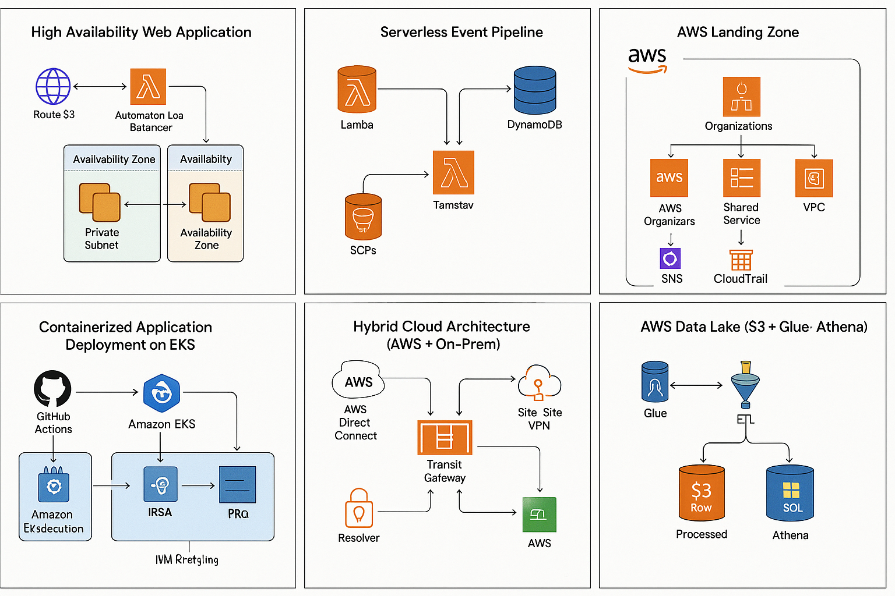

# High Availability Web Application (AWS)

## 📌 Architecture Overview
A production-grade HA architecture using:

- Route 53
- Application Load Balancer (ALB)
- Auto Scaling Group (EC2)
- Multi-AZ private subnets
- NAT Gateway (optional)
- CloudWatch metrics + alarms
- S3 logging

This follows the AWS Well-Architected pillars of **Reliability**, **Security**, and **Operational Excellence**.

## 🧩 Diagram

## 🛠 What This Demonstrates
- Multi-AZ resiliency
- Auto-healing workloads
- Load balancing & health checks
- Network segmentation (public vs private)
- Terraform IaC patterns

## 💬 Interview Talking Points
- Why ALB vs NLB
- Why private subnets for back-end compute
- How auto scaling reacts to load
- How health checks prevent downtime

## 📂 Terraform Code
See the `terraform/` directory.
